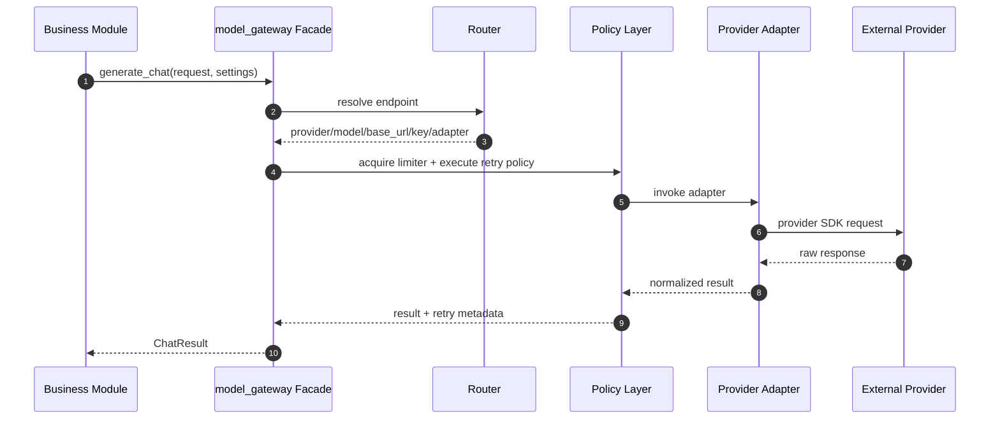

# Model Gateway Design

## Goal

`model_gateway` is the unified request layer for all external model-facing calls in the Python video pipeline.

It exists to centralize:

- provider resolution
- model endpoint resolution
- API key and base URL lookup
- timeout handling
- retry policy
- concurrency limiting
- telemetry and request tracing
- future routing, fallback, and load balancing

It does not own:

- prompt construction
- video frame extraction
- subtitle analysis
- narration/polish/speech business semantics

Business modules keep their domain logic. `model_gateway` only standardizes how requests are sent and governed.

## Why This Layer Is Needed

Today, external calls are spread across multiple modules:

- `narration`
- `narration_polish`
- `subtitle_context`
- `narration_speech`

Each module currently contains some combination of:

- provider slug resolution
- API key lookup
- base URL lookup
- SDK client creation
- raw provider request execution

That shape does not scale well once the system needs:

- provider-level retry
- provider/model concurrency limits
- per-capability routing
- multi-key rotation
- fallback providers
- unified cost and latency tracking

## Current External Call Sites

Current external request locations in the codebase:

- `python/narration/src/narration/story.py`
  - OpenAI-compatible chat completion request
- `python/narration_polish/src/narration_polish/polish.py`
  - OpenAI-compatible chat completion request
- `python/subtitle_context/src/subtitle_context/embedding.py`
  - OpenAI-compatible embedding request
- `python/narration_speech/src/narration_speech/speech.py`
  - `edge-tts` speech synthesis request

These should become gateway consumers instead of instantiating raw clients directly.

## Scope

Phase 1 scope:

- unify OpenAI-compatible chat requests
- unify OpenAI-compatible embedding requests
- define the speech gateway shape
- keep existing business module inputs and outputs stable

Phase 2 scope:

- move `edge-tts` behind gateway
- add retry and limiter policy
- add telemetry hooks

Phase 3 scope:

- add routing profiles
- add provider fallback
- add multi-key balancing

## Layering

```text
business modules
  narration
  narration_polish
  subtitle_context
  narration_speech
        |
        v
model_gateway facade
        |
        +--> router
        +--> retry / limiter / telemetry
        +--> provider adapters
                - openai_compatible
                - edge_tts
                - future adapters
```

## Module Layout

Suggested package:

```text
python/model_gateway/
  pyproject.toml
  setup.py
  src/model_gateway/
    __init__.py
    facade.py
    router.py
    errors.py
    types.py
    policies.py
    telemetry.py
    adapters/
      __init__.py
      openai_compatible.py
      edge_tts.py
  tests/
    test_facade.py
    test_router.py
    test_openai_compatible.py
    test_edge_tts.py
```

## Public Interface

The business-facing API should stay small.

### Chat

```python
def generate_chat(request: ChatRequest, *, settings: Settings) -> ChatResult: ...
```

Use cases:

- narration generation
- narration polish
- future text-only summarization
- future multimodal generation

### Embedding

```python
def embed_texts(request: EmbeddingRequest, *, settings: Settings) -> EmbeddingResult: ...
```

Use cases:

- subtitle context index build
- future retrieval pipelines

### Speech

```python
def synthesize_speech(request: SpeechRequest, *, settings: Settings) -> SpeechResult: ...
```

Use cases:

- narration speech generation

## Request Types

Use stable DTOs so business modules do not depend on provider SDK request formats.

### RequestMeta

```python
from dataclasses import dataclass, field
from typing import Any, Mapping

@dataclass(frozen=True)
class RequestMeta:
    module: str
    capability: str
    job_id: str | None = None
    chunk_id: str | None = None
    segment_id: str | None = None
    user_id: str | None = None
    trace_id: str | None = None
    extra: Mapping[str, Any] = field(default_factory=dict)
```

Purpose:

- trace requests through the workflow
- support telemetry and later billing/accounting

### Chat DTOs

```python
from dataclasses import dataclass
from typing import Sequence

@dataclass(frozen=True)
class MessagePart:
    type: str
    text: str | None = None
    image_url: str | None = None
    media_type: str | None = None

@dataclass(frozen=True)
class ChatMessage:
    role: str
    content: str | Sequence[MessagePart]

@dataclass(frozen=True)
class ChatRequest:
    provider: str
    model: str
    messages: Sequence[ChatMessage]
    temperature: float | None = None
    max_tokens: int | None = None
    timeout_sec: float | None = None
    response_format: str | None = None
    meta: RequestMeta | None = None
```

### Embedding DTO

```python
@dataclass(frozen=True)
class EmbeddingRequest:
    provider: str
    model: str
    texts: Sequence[str]
    batch_size: int | None = None
    timeout_sec: float | None = None
    meta: RequestMeta | None = None
```

### Speech DTO

```python
@dataclass(frozen=True)
class SpeechRequest:
    provider: str
    voice: str
    text: str
    rate: str | None = None
    volume: str | None = None
    pitch: str | None = None
    boundary: str | None = None
    output_path: str | None = None
    timeout_sec: float | None = None
    meta: RequestMeta | None = None
```

## Response Types

### Shared Metadata

```python
@dataclass(frozen=True)
class UsageInfo:
    prompt_tokens: int | None = None
    completion_tokens: int | None = None
    total_tokens: int | None = None
    estimated_cost: float | None = None

@dataclass(frozen=True)
class GatewayResponseMeta:
    provider: str
    model: str
    request_id: str | None = None
    retry_count: int = 0
    latency_sec: float | None = None
```

### ChatResult

```python
@dataclass(frozen=True)
class ChatResult:
    text: str
    finish_reason: str | None
    usage: UsageInfo | None
    meta: GatewayResponseMeta
    raw: object | None = None
```

### EmbeddingResult

```python
@dataclass(frozen=True)
class EmbeddingResult:
    vectors: tuple[tuple[float, ...], ...]
    usage: UsageInfo | None
    meta: GatewayResponseMeta
    raw: object | None = None
```

### SpeechResult

```python
@dataclass(frozen=True)
class SpeechResult:
    audio_path: str
    boundary_path: str | None = None
    meta: GatewayResponseMeta | None = None
    raw: object | None = None
```

## Error Model

Business modules should not need to understand SDK-specific exceptions.

```python
class GatewayError(Exception): ...
class GatewayConfigError(GatewayError): ...
class GatewayAuthError(GatewayError): ...
class GatewayRateLimitError(GatewayError): ...
class GatewayTimeoutError(GatewayError): ...
class GatewayTransientError(GatewayError): ...
class GatewayProviderError(GatewayError): ...
class GatewayUnsupportedCapabilityError(GatewayError): ...
```

Benefits:

- clean retry policy
- consistent failure handling in orchestrators/workers
- future provider fallback logic becomes easier

## Routing Interface

The router resolves how a request should be sent.

### ResolvedEndpoint

```python
@dataclass(frozen=True)
class ResolvedEndpoint:
    provider: str
    model: str
    base_url: str | None
    api_key: str | None
    adapter: str
```

### Router functions

```python
def resolve_chat_endpoint(request: ChatRequest, settings: Settings) -> ResolvedEndpoint: ...
def resolve_embedding_endpoint(request: EmbeddingRequest, settings: Settings) -> ResolvedEndpoint: ...
def resolve_speech_endpoint(request: SpeechRequest, settings: Settings) -> ResolvedEndpoint: ...
```

Phase 1 behavior:

- use provider and model already resolved by business settings/options
- resolve `api_key`
- resolve `base_url`
- select adapter name

Future behavior:

- provider fallback
- multi-key pools
- route by product tier
- route by capability profile

## Adapter Contract

Adapters convert gateway DTOs into provider SDK calls.

### ChatAdapter

```python
class ChatAdapter(Protocol):
    def generate_chat(self, request: ChatRequest, endpoint: ResolvedEndpoint) -> ChatResult: ...
```

### EmbeddingAdapter

```python
class EmbeddingAdapter(Protocol):
    def embed_texts(
        self,
        request: EmbeddingRequest,
        endpoint: ResolvedEndpoint,
    ) -> EmbeddingResult: ...
```

### SpeechAdapter

```python
class SpeechAdapter(Protocol):
    def synthesize_speech(
        self,
        request: SpeechRequest,
        endpoint: ResolvedEndpoint,
    ) -> SpeechResult: ...
```

## Facade Execution Flow

Each facade call should follow the same high-level shape:

1. validate DTO
2. resolve endpoint through router
3. acquire concurrency limiter
4. run adapter under retry wrapper
5. map provider errors to gateway errors
6. emit telemetry
7. return normalized result DTO

## Mermaid Sequence



## Mapping to Existing Modules

### narration

Current responsibility:

- select frames
- build multimodal prompt
- parse narrative response text

Gateway integration:

- replace raw OpenAI-compatible client call with `generate_chat`
- keep prompt assembly in `narration`

### narration_polish

Current responsibility:

- build polish prompt
- interpret response text and timing fit information

Gateway integration:

- replace raw OpenAI-compatible client call with `generate_chat`

### subtitle_context

Current responsibility:

- batch text chunks
- request embeddings
- save vectors/index artifacts

Gateway integration:

- replace raw embedding client call with `embed_texts`

### narration_speech

Current responsibility:

- synthesize speech
- fit duration
- write audio metadata
- ffmpeg post-processing

Gateway integration:

- in Phase 1, keep direct implementation
- in Phase 2, move the provider request behind `synthesize_speech`
- keep duration-fit logic in `narration_speech`

## Settings and Configuration

Current gateway config should use:

- `gateway.default_provider`
- `api_providers`
- `api_keys`
- `model_catalog`
- `model_defaults`
- `tts_defaults`
- `video_defaults`

## Future Gateway-Specific Config

Possible later config section:

```yaml
gateway:
  retry:
    max_attempts: 3
    backoff_base_sec: 0.5
  limits:
    openai_compatible_concurrency: 4
    edge_tts_concurrency: 2
  routing:
    enable_fallback: true
```

This should stay separate from prompt/business config.

## Telemetry Requirements

Every gateway request should be able to record:

- module
- capability
- provider
- model
- job_id
- chunk_id
- segment_id
- latency_sec
- retry_count
- success or failure
- mapped error type
- token usage when available

This should support:

- debugging
- rate-limit investigation
- cost analysis
- future tenant accounting

## Retry and Limiter Strategy

Initial policy recommendations:

- retry on timeout
- retry on 429
- retry on provider 5xx or transient transport failures
- do not retry auth/config errors

Limiter recommendations:

- provider-level concurrency limit
- later extend to provider+capability or provider+model

Example:

- narration chat requests and polish chat requests may share one OpenAI-compatible limiter initially
- later they can be split by capability

## Stability Rules

To keep module boundaries clean:

- business modules must not construct raw provider SDK clients
- business modules must not implement provider retry logic
- business modules must not parse provider-specific rate-limit errors directly
- provider-specific request mapping stays inside adapters

## Phase 1 Implementation Checklist

1. Create `python/model_gateway` package.
2. Add `types.py`, `errors.py`, `router.py`, `facade.py`.
3. Add OpenAI-compatible adapter.
4. Add unit tests for chat and embedding normalization.
5. Refactor `narration` to use `generate_chat`.
6. Refactor `narration_polish` to use `generate_chat`.
7. Refactor `subtitle_context.embedding` to use `embed_texts`.
8. Keep `narration_speech` unchanged for now.
9. Verify current manual pipeline still runs.

## Phase 2 Implementation Checklist

1. Add `edge_tts` adapter.
2. Refactor `narration_speech` to use `synthesize_speech`.
3. Add retry wrappers.
4. Add provider-level limiter registry.
5. Add basic telemetry hook interface.

## Phase 3 Implementation Checklist

1. Add route profiles.
2. Add multi-key pools.
3. Add provider fallback.
4. Add request cost estimation hooks.
5. Add per-capability limiter policies.

## Non-Goals

This module should not:

- decide prompt style
- choose narration segments
- decide narration/polish enablement
- decide frame sampling strategy
- own workflow orchestration

Those responsibilities stay in:

- `movieteller_config`
- `subtitle_analysis`
- `frame_source`
- `movie_pipeline`

## Summary

`model_gateway` is the shared request governance layer between business modules and external providers.

It standardizes request execution without collapsing business boundaries.

The recommended adoption path is incremental:

- Phase 1: chat + embedding
- Phase 2: speech + retry/limiters
- Phase 3: routing/fallback/load balancing
