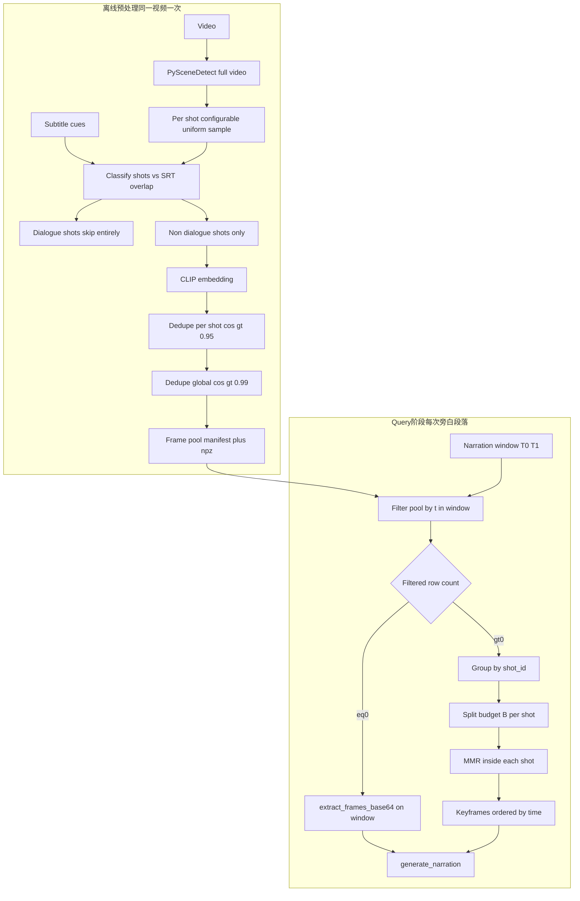

# 视频预处理帧池 + 旁白时段取用（修订版）

## 与旧版计划的关系

- **旧版**（段落内分镜 + 比例分配等）不作为并列实现保留。
- **本文主路径**：帧池 + Query MMR；**不增加** `narration_frame_source: uniform | frame_pool` 之类全局开关，避免 `narrate_segment_with_duration` 长期维护两套逻辑。
- **窄回退**（唯一允许的「均匀取帧」）：仅当 **某旁白时间窗在帧池过滤结果为空** 时，在该窗上调用现有 [`extract_frames_base64`](python/narration/src/narration/frames.py)，**`max_frames` 使用独立配置** `pool_miss_uniform_max_frames`（默认可与 `max_frames_per_segment` 同值，但语义分离便于调参）。**不**把「无池文件」当作回退到旧主路径：manifest 缺失 / 路径错误应 **直接报错**，引导先 `build_pool`。

## 总体数据流



**与下列文字流程等价**（预处理 / Query 分界）：

```text
Video
  → Shot Detection（PySceneDetect）
  → Frame Sampling（每非台词 shot 均匀 K 帧，K 由配置 min/max / 可选 rate 决定）
  → CLIP Embedding
  → 去重：各 shot 内 cosine 大于 0.95 去一帧
  → 去重：全池跨 shot cosine 大于 0.99 去一帧
  → Frame Pool（manifest 含 shot_id、t_sec、embedding_index、image_ref）
  ────────────────────
Query 阶段（每次旁白时间窗）：
  → 按 [T0,T1] filter 池记录
  → 若 **0 条**：对该窗 **extract_frames_base64**，max_frames = pool_miss_uniform_max_frames（可配置）→ LLM
  → 若 **≥1 条**：按 shot_id 分组 → shot 内 MMR → 跨 shot 压至 B → keyframes → LLM
```

## 1. 分镜（Shot Detection）

- **工具**：**PySceneDetect**（按你的要求；不再把 ffmpeg scene 作为默认主路径，可保留为降级或调试）。
- **范围**：对 **整段视频** 跑一次，得到全局有序区间 `[s_i, e_i)`，与 `[0, duration]` 裁剪、**极短镜合并**（配置 `merge_sec`）。
- **输出**：镜头列表供后续步骤使用（不落池字段也可）。

## 2. 每镜采样与台词镜（首期规则）

### 2.1 每 shot 采样帧数（**可配置**）

以下写入 **`movieteller_config`**（`default.yaml` / `config/local.yaml`）并由 **`loader.py`** 映射 `POOL_FRAMES_PER_SHOT_*` 等环境变量（命名与现有 `NARRATION_*` 风格对齐亦可）：

| 配置项 | 含义 |
|--------|------|
| `pool_frames_per_shot_min` | 每个非台词 shot 至少采 **整数 ≥1** 帧（默认 **1**） |
| `pool_frames_per_shot_max` | 每个非台词 shot 至多采 **整数 ≥ min** 帧（默认 **3**） |
| `pool_frames_per_shot_rate`（可选） | 每秒镜头时长对应的目标采样率，例如 `0.5` 表示约 `ceil(d_i * 0.5)`，再 **clamp 到 [min,max]**；未配置时可用 **恒为 max** 或 **恒为 min** 的简单策略（实现时选一种并文档化） |
| `pool_miss_uniform_max_frames` | **仅**当某旁白时间窗在帧池中 **过滤结果为 0 条** 时，对该窗调用 `extract_frames_base64` 的 **`max_frames`**（默认 **24**，可独立于 **B** 调参） |

**`K` 的计算**（建议）：`K = clamp(round(d_i * rate), min, max)`；若未启用 `rate`，则 **`K = max`** 或按镜长分段阶梯（可选 `pool_frames_per_shot_strategy`：`fixed_max` \| `clamp_rate`——首期实现一种即可，另一种标为 follow-up）。

**缓存**：**`pool_frames_per_shot_*`、rate/strategy、`pool_dedupe_*`、CLIP 模型** 等任一变更 → **必须重建帧池**（写入 manifest `build_config` 或缓存目录名哈希）。

### 2.2 台词镜

- **判定**：镜头 `[s_i,e_i)` 与任一字幕 cue 重叠超过 `dialogue_overlap_threshold` → 台词镜。
- **规则**：**整镜不入池**（不采样、不 CLIP、无 manifest 行）。

### 2.3 后续扩展（计划外）

台词画面作上下文的第二通道与帧池解耦。

## 3. CLIP Embedding（仅预处理）

- **输入范围**：仅 **非台词镜** 在 §2 中采样的帧序列（台词镜整镜跳过，不产生向量）。
- **依赖**：`torch` + **`open_clip`** 或 **`transformers`+CLIP**（计划在配置中可选 `clip_model_id` / `clip_pretrained`）。
- **输入图像**：与现有一致，建议 **ffmpeg 缩放后** 的 RGB（可与当前 `narration_frame_max_edge` 对齐，避免过大 tensor）。
- **输出**：每帧 **L2 归一化** CLIP 向量；经 **§3.1 两轮去重** 后，再与 `shot_id`、`t_sec` 对齐写入 **`.npz` + manifest**。**不在此阶段做聚类或 MMR**（去重仅为阈值 + 保留规则）。

### 3.1 建池前余弦去重（两轮，写入 manifest / npz 之前）

前提：向量已 **L2 归一化**，则两帧余弦相似度 **等于点积** `sim(i,j)=e_i·e_j`。

1. **镜内（for each `shot_id`）**  
   对该 shot 内候选帧，若存在一对 **`sim > pool_dedupe_shot_cosine_threshold`**（默认 **0.95**），则 **删除其中一帧**。  
   **保留规则**（须写死、可测）：建议 **保留 `t_sec` 更小者**（时间更早）；若并列再按原采样顺序。

2. **全局（Frame Pool 全体）**  
   镜内去重完成后，将全部剩余帧放在一起；若跨 shot 存在 **`sim > pool_dedupe_global_cosine_threshold`**（默认 **0.99**），同样 **删一留一**，**同一保留规则**（优先保留更早 `t_sec`），避免跨镜重复构图。

**阈值可配置**：`pool_dedupe_shot_cosine_threshold`、`pool_dedupe_global_cosine_threshold` 写入 `movieteller_config` 并进入 **池缓存键**（改阈值须重建池）。

**复杂度**：镜内 \(n \le\) `pool_frames_per_shot_max`，\(O(n^2)\) 可忽略；全局 \(N\) 为镜头数 × 每镜少量帧，一般可接受。若未来单视频 \(N\) 上千，再考虑近似近邻（follow-up，非首期）。

## 4. Query 阶段：按窗过滤 → shot 内 MMR → keyframes

与预处理解耦，**所有 MMR 超参仅在 Query 侧配置**，便于迭代调参而无需重建整池。

**输入**：帧池 manifest 可读 + 旁白时间窗 `[T0,T1]` + 总预算 **`B`**（`max_frames_per_segment` 或旁白专用上限）。

**零命中**（步骤 1 过滤后 **0 行**）：不对该窗跑 MMR；直接 **`extract_frames_base64(video, T0, T1, max_frames=pool_miss_uniform_max_frames, ...)`**（沿用现有 `narration_frame_max_edge` / `ffmpeg_path`），再 `generate_narration`。`pool_miss_uniform_max_frames` **独立可配**（建议默认 **24**，与历史观感接近，但与 `B` 解耦）。

**正常路径**（步骤 1 至少 1 行）：继续步骤 2–5。

**步骤**（实现时固定顺序并单测）：

1. **时间过滤**：取出所有 `T0 ≤ t_sec ≤ T1` 的池记录；若为 **0** 条 → 转 **零命中** 分支并结束 Query 链。
2. **按 `shot_id` 分组**：每组为该 shot 在窗内的候选帧（每 shot 池内至多 **`pool_frames_per_shot_max`** 条，由建池配置决定）。
3. **跨 shot 配额**：按各 shot 与 `[T0,T1]` **相交时长占比** 将整数 **`B`** 拆为 `B_s`，`\sum B_s = B`；若某 shot 候选数 `< B_s`，余量用 largest remainder 分给其它 shot。
4. **shot 内 MMR**：对每组至多 **`pool_frames_per_shot_max`** 个 CLIP 向量跑 MMR；**query** 由 `mmr_query_vector` 配置（组内质心 / 窗中点最近帧 / 预留文本）。每组输出 **≤ min(候选数, B_s)** 帧。
5. **输出 keyframes**：按 `t_sec` 排序 → PNG → base64 → [`generate_narration`](python/narration/src/narration/story.py)。

**说明**：单帧 shot 无 MMR 分支成本；候选数为 2～`K_max` 时为小规模 MMR（`K_max` 即 `pool_frames_per_shot_max`）。

## 5. 帧池（Frame Pool）结构

首期 **manifest 中仅含非台词镜** 筛出的关键帧；每条记录建议至少包含：

| 字段 | 含义 |
|------|------|
| `t_sec` | 时间戳（建议 **帧中心时间** 或 `pts`，与视频时间轴一致） |
| `shot_id` | 与全片分镜列表一致的全局镜头 id（与 PySceneDetect 输出对齐） |
| `image_ref` | 相对池目录的 PNG 路径，或内联 base64（大文件不推荐） |
| `embedding_index` | 指向 `.npz` 中第几行（若外存向量） |

可选：另写 `shots.json` 列出 **全部** 镜头区间及 `is_dialogue` 便于调试；**不要求**在每条池记录上重复存 `dialogue_overlap`（恒为 false 时可省略）。

池目录示例：`{video_stem}.frame_pool/` 下 `manifest.jsonl` + `embeddings.npz` + `images/*.png`。

## 6. 旁白集成（`narrate_segment_with_duration`）

在 [`narrate_segment_with_duration`](python/narration/src/narration/narrate.py)（或前置 helper）中：

1. **解析帧池路径**（来自配置或调用参数）；**manifest 不存在或 schema 不兼容 → 抛错**（不静默回退到「旧全局均匀」）。
2. 执行 **§4**（含 **零命中** 窄回退：`extract_frames_base64` + `pool_miss_uniform_max_frames`）。
3. `generate_narration`。

**实现约束**：`narrate` 内 **不出现** `if narration_frame_source == uniform` 之类与帧池平行的整条旁路；仅 **「池窗零命中」** 一处调用 `extract_frames_base64`。

## 7. 代码与包布局建议

| 模块 | 职责 |
|------|------|
| 新包 `python/video_frame_pool/`（或 `narration/pool/`） | 建池 CLI、`dedupe_pool_frames`（两轮）、`build_pool(...)`、manifest / npz 读写 |
| `narration/scenes_pyscenedetect.py` | 全片分镜 |
| `narration/query_frames.py`（或 `mmr_select.py`） | 时间过滤、按 shot 分组、shot 内 MMR、跨 shot 压至 **B**（不负责零命中；零命中由 narrate 调 `extract_frames_base64`） |
| `narration/narrate.py` | 加载 manifest；调 Query；**零命中**时单次 `extract_frames_base64(..., max_frames=pool_miss_uniform_max_frames)` |
| `movieteller_config` | `frame_pool_manifest`、`pool_frames_per_shot_*`、`pool_miss_uniform_max_frames`、`pool_dedupe_shot_cosine_threshold`（默认 **0.95**）、`pool_dedupe_global_cosine_threshold`（默认 **0.99**）、`pyscenedetect_*`、`dialogue_overlap_threshold`、`clip_*`、`mmr_query_lambda`、`mmr_query_vector`、`max_frames_per_segment`（**B**）等 |

**subtitle_analysis**：`--narrate` 前需已 `build_pool` 或传 `--frame-pool`。

## 8. 性能与工程注意

- **预处理**：CLIP + **两轮去重**；缓存键含 **`pool_dedupe_*`**（改阈值须重建池）；MMR 超参仍不使池失效。
- **Query**：每窗每 shot 候选数 **≤ `pool_frames_per_shot_max`**，MMR 成本随 `K_max` 线性有界；调 MMR 无需重建池。
- **CI**：mock embedding；单测覆盖 **两轮去重**、MMR 与预算分配。

## 9. 验收标准（修订）

- 缺 manifest / schema 不匹配：**须失败**（不进入旧全局均匀模式）。
- 窗内池记录 **≥1**：走 MMR 链，送 LLM 帧数 **≤ B**。
- 窗内池记录 **==0**：仅调用 **`extract_frames_base64`**，且 **`max_frames == pool_miss_uniform_max_frames`**（与配置一致）。
- 建池后：对随机抽样的池内向量对，**镜内同 shot** 不应出现 `sim > shot_threshold`（在浮点 ε 内）；**全局**不应出现 `sim > global_threshold`（单测用可控向量更稳）。
- 建池后：cue 重叠镜在 manifest 中无 `t_sec` 落入该镜区间。
- 同一 `shot_id` 在池中帧数 **≤ `pool_frames_per_shot_max`**。
- manifest schema 版本不匹配：**须失败**或显式降级策略在 README 中单点说明（不允许静默走旧全局均匀）。

## 10. 待你拍板（实现前可默认）

- **未配置 `pool_frames_per_shot_rate` 时**：`K` 取 **`fixed_max`**（每非台词 shot 恒采 `max` 帧）或 **`fixed_min`**——实现时选一种作为 default.yaml 默认并写 README。
- **CLIP 权重**：默认小模型（CPU 友好）。
- **跨 shot 压至 B**：默认 **按时长在窗内占比分配各 shot 配额** 后再 shot 内 MMR；备选「全局二次 MMR」写在代码注释中。
- **池内图像**：默认 PNG 路径引用。
