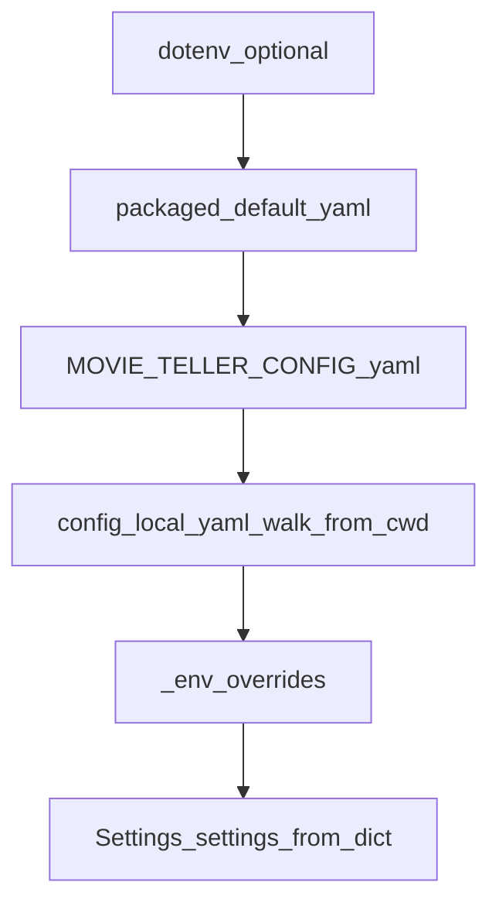
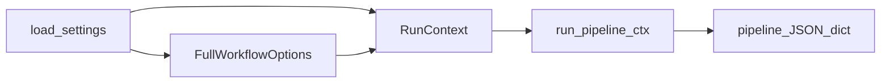

# Runtime config and payload architecture

This page summarizes the post-refactor data flow. For motivation and task
history see
[runtime-config-and-payload-structure-review.md](runtime-config-and-payload-structure-review.md),
[runtime-config-and-payload-refactor-task-list.md](runtime-config-and-payload-refactor-task-list.md),
and the dual-pass inventory
[runtime-config-dual-pass-inventory.md](runtime-config-dual-pass-inventory.md).
For the next “subtraction” phase (single entry, fewer fallbacks), see
[subtraction-next-phase.md](subtraction-next-phase.md).

## Merge flow (config)

## Pipeline flow (orchestration)

## Payload typing

- TypedDict contracts live in
  `python/movie_pipeline/src/movie_pipeline/payload_schema.py`.
- Parse / serialize helpers: `parse_pipeline_text_dict`,
  `parse_pipeline_text_json_path`, `serialize_pipeline_text_payload`.

## Continuation APIs

- `python/movie_pipeline/src/movie_pipeline/workflow_continue.py` —
  TTS and render from an existing text-stage payload dict.
- `python/movie_pipeline/src/movie_pipeline/subtitle_merge_stage.py` —
  `merge_subtitles_for_narration` wraps narration-video merge for reuse.

## Gateway routing

- `resolve_capability_model_endpoint` in
  `python/model_gateway/src/model_gateway/router.py` is the single entry for
  settings-driven **narration / polish / embedding / tts** model endpoints used
  by `model_gateway.facade`.
