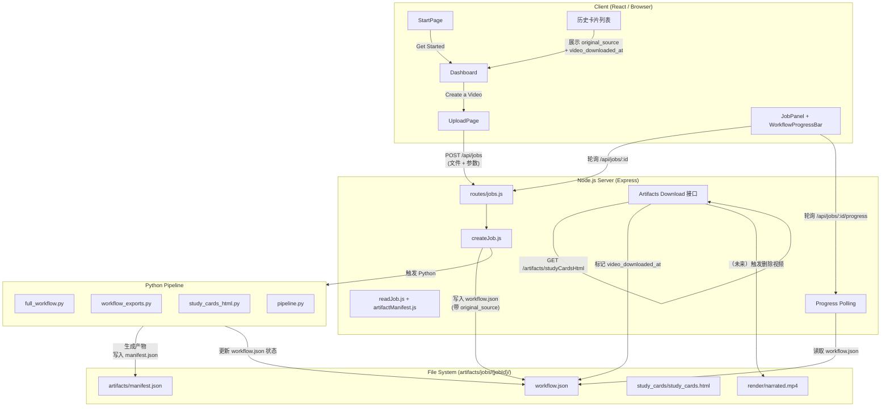
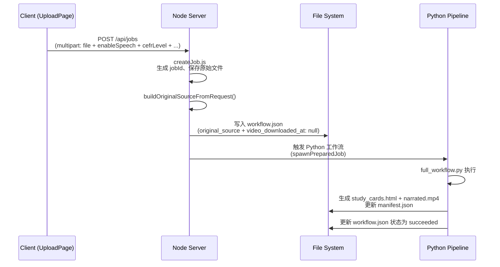
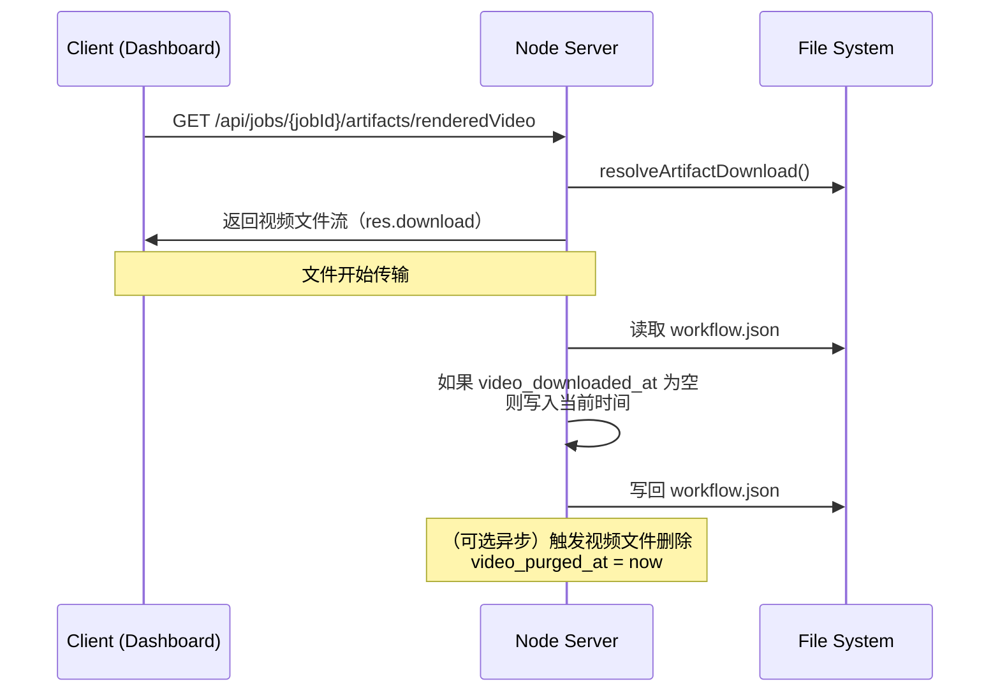
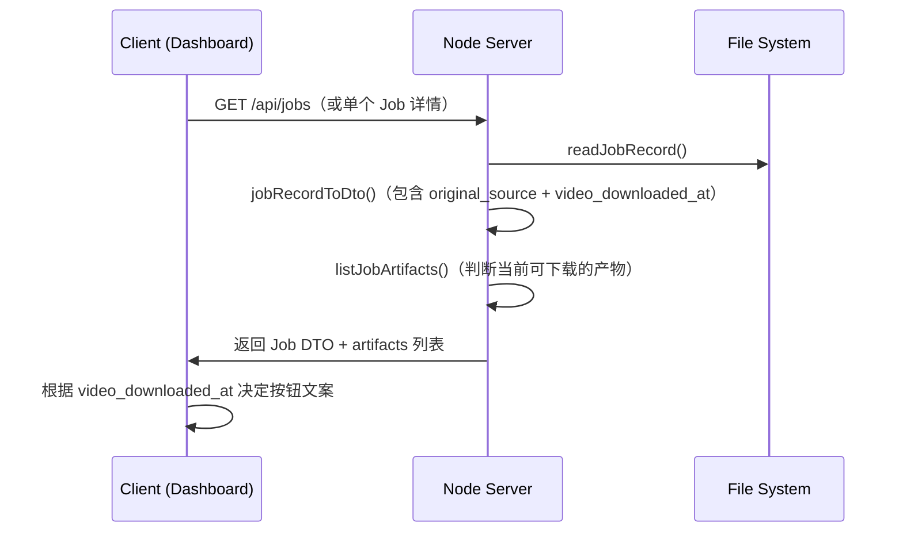

# MovieTeller 当前数据流图（2026-05-30 更新版）

本图聚焦于 **Job 生命周期**、**视频/学习卡存储策略**（下载一次即删除视频）、以及 `original_source` + `video_downloaded_at` 字段的流转。

---

## 1. 整体架构泳道图（推荐阅读）

---

## 2. 关键流程详细时序图

### 2.1 Job 创建流程（含 original_source 写入）

### 2.2 视频下载 + 标记删除流程（核心存储策略）

**关键点**：
- 只有 `kind === "renderedVideo"` **且不是 `?inline=true` 预览** 时才会标记。
- 标记后即可认为用户已拿到视频，文件可以被安全删除。

### 2.3 Dashboard 历史卡片数据获取流程

---

## 3. 字段流转总结表

| 字段                    | 写入时机                     | 写入位置               | 读取位置                  | 作用 |
|-------------------------|------------------------------|------------------------|---------------------------|------|
| `original_source`       | Job 创建时                   | `createJob.js`         | Dashboard、重新生成逻辑   | 记录原始素材来源，支持一键重新生成 |
| `video_downloaded_at`   | 用户第一次成功下载视频后     | `routes/jobs.js` 下载接口 | Dashboard 卡片状态判断    | 触发“视频已删除”状态 + 后续清理 |
| `video_purged_at`       | 视频文件被真正删除后（可选） | 清理任务               | 审计/日志                 | 记录清理时间 |
| `artifacts`             | Python 生成产物后            | Python `workflow_exports.py` | `artifactManifest.js`     | 记录当前可下载的产物列表 |

---

## 4. 当前（2026-05-30）存储策略总结

- **视频文件**（`narrated.mp4`）：**下载一次即标记删除**（不长期保存）
- **学习卡**（`study_cards.html`）：目前倾向长期保留（用户核心价值）
- **原始来源**（`original_source`）：永久保留（支持重新生成）
- **workflow.json**：永久保留（元数据核心）

---

如果你需要我把这张图进一步拆成：
- 更简化的高层图
- 仅包含“重新生成”流程的图
- 加入未来“自动清理任务”的图

随时告诉我，我可以继续补充或生成单独的 Mermaid 图。