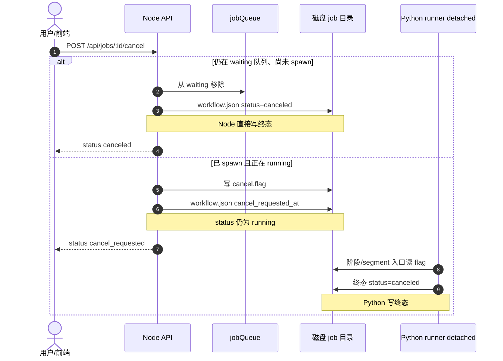
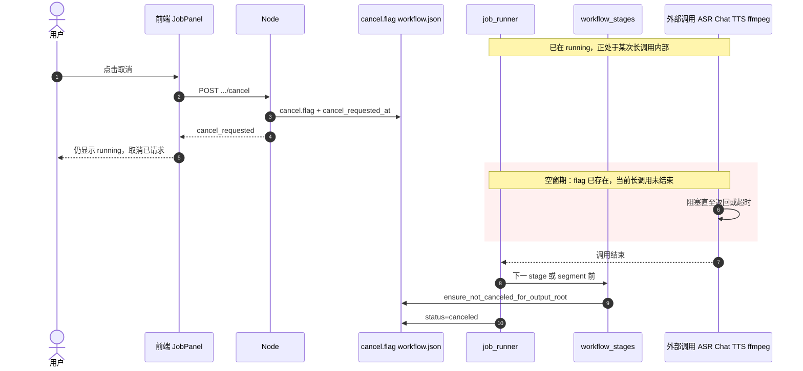
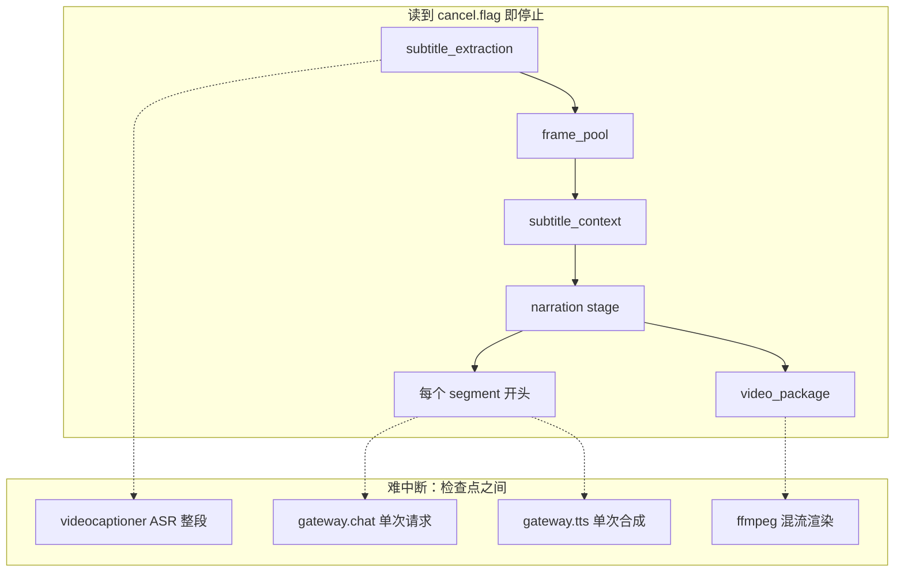

# 本地开发与运行（Job 主链路）

本文档描述当前 **产品化 Alpha** 的推荐运行方式：浏览器上传视频 → Job API → Python workflow → 轮询状态与下载产物。

> **已不是 Mock MVP**：早期 `POST /api/generate` 仅返回假旁白，**请勿**再把它当作主流程。真实处理走 **Job API**（见 [jobs-api.md](./jobs-api.md)）。

## 能力边界（当前版本）

| 有 | 尚无 |
|----|------|
| 单机本地：上传、队列、后台 Python、进度/日志、取消、产物下载 | 生产级 Clerk / Postgres（见 Phase 2 设计文档） |
| Cookie 会话 + 每用户 Job ACL（`user_id`）；可选 Clerk Bearer（见 [auth-plan.md](./auth-plan.md)） | 分布式多 Worker（Phase 2 队列） |
| 文件态 Job：`artifacts/jobs/{jobId}/` | 服务重启后自动续跑（combined 下僵尸 Job 标 `failed`） |
| 列表 `limit` 最大 **1000**；**3 天** retention 删除整 Job 目录 | UI 仅展示「最近 8 条」（已取消，见 [job-lifecycle.md](./job-lifecycle.md)） |
| 视频下载一次 + 410；学习卡长期可访问 | 润色/字幕上下文无 UI 开关（默认开启） |
| 对外产物：**旁白成片** + **学习卡片**（manifest-only） | 仓库内固定 E2E 样例视频（可自备 mp4 跑 smoke） |

产品化阶段规划见 [productization-roadmap.md](./productization-roadmap.md)。

## 架构一览

```text
浏览器 (client :5173)
  │  /api → Vite 代理
  ▼
Express (server :3001)
  │  POST /api/jobs → 写磁盘 + 内存队列
  │  spawn: python -m movie_pipeline.job_runner
  ▼
Python workflow (full_workflow)
  │  写 workflow.json、logs/workflow.jsonl、artifacts/manifest.json
  ▼
前端轮询 GET /jobs/:id、/progress、/logs；成功后 GET /artifacts
```

## 前置条件

- **Node.js 18+**（建议 LTS）
- **Python 3.12**
- **ffmpeg**（混流、抽帧等；`GET /api/healthz/deep` 会检查）
- **VideoCaptioner CLI**（字幕 ASR，`videocaptioner` 在 PATH 或配置 `videocaptioner_bin`）
- **API 配置**：复制根目录 [.env.example](../.env.example) → `.env`，并按 [movieteller_config 说明](../python/movieteller_config/README.md) 配置 provider / key（旁白、TTS 等会调真实模型）

## 1. Python 环境（仓库根 `.venv`）

在仓库根目录执行（与 Node `pythonRuntime.js` 的 `PYTHONPATH` 一致）：

```bash
cd /path/to/MovieTeller
python3.12 -m venv .venv
source .venv/bin/activate

python -m pip install -U pip
python -m pip install videocaptioner pytest

# 按依赖顺序 editable 安装（与 server  spawn 包列表一致）
for pkg in movieteller_config movieteller_logging pipeline_types media_utils model_gateway \
  subtitle_extraction subtitle_analysis frame_source narration narration_polish narration_speech \
  narration_video pipeline_transcript rerank video_render subtitle_context video_frame_pool \
  movie_pipeline; do
  python -m pip install -e "./python/${pkg}"
done
```

Node 启动 Job 时优先使用 **`.venv/bin/python3`**（可通过环境变量 `MOVIE_TELLER_PYTHON` 覆盖）。

## 2. 配置

- **优先级**：环境变量 > `config/local.yaml`（gitignore）> 默认。
- 模板：`.env.example`、`config/local.yaml.example`。
- 未配置 API 时 Job 可能在字幕/旁白/TTS 阶段 **failed**，属预期；用 `workflow.json` 与 `logs/workflow.jsonl` 排查。

## 3. 启动后端

```bash
cd server
npm install
npm run dev
```

- 默认：**http://localhost:3001**
- 浅健康检查：`GET /health`
- 深度检查（ffmpeg、jobs 目录、job_runner）：`GET /api/healthz/deep`
- 启动时会扫描 `JOBS_ROOT`，将仍为 `queued`/`running` 的旧 Job 标为 `failed`（`server_restarted`）

常用环境变量：

| 变量 | 说明 |
|------|------|
| `PORT` | 默认 `3001` |
| `JOBS_ROOT` | 默认 `<repo>/artifacts/jobs` |
| `MAX_RUNNING_JOBS` | 同时运行数，默认 `1` |
| `MOVIE_TELLER_PYTHON` | 指定解释器 |

## 4. 启动前端

新终端：

```bash
cd client
npm install
npm run dev
```

浏览器打开 **http://localhost:5173**（以终端输出为准）。`/api` 由 [client/vite.config.ts](../client/vite.config.ts) 代理到 `localhost:3001`；改端口需前后端一致。

### 多用户与登录（Phase 1）

- 真实登录主路径使用 Clerk：前端 `VITE_CLERK_PUBLISHABLE_KEY` + 后端 `CLERK_SECRET_KEY`，`apiFetch` 发送 `Authorization: Bearer <Clerk token>`。
- Job owner 写入 `workflow.json.user_id`，取值来自后端验证后的 Clerk user id；创建 Job 不信任 body/frontend 传入的 `userId`。
- 生产环境只接受 Clerk Bearer；`mt_uid`、`X-MovieTeller-User-Id`、`demo-user` fallback 都不生效，`/api/dev/*` 不注册。
- 非生产未配置 Clerk 时，可继续用 demo cookie 联调：`POST /api/dev/session`，body `{"userId":"user-a"}`；也可使用 `?asUser=user-a`。
- 受保护 Job 资源必须通过 `apiFetch`/Blob/`srcDoc` 获取，避免裸 `<a href="/api/jobs/...">` 或 `` 绕过 Bearer。
- 无 `user_id` 的历史 Job 不会出现在任何用户列表中。详见 [auth-plan.md](./auth-plan.md) 与 [multi-user-storage-and-transport.md](./multi-user-storage-and-transport.md)。

### 前端能做什么

1. **上传创建 Job**：`POST /api/jobs`（MP4 等，见 API 文档）；可用 `?jobId=` 打开已有任务。
2. **任务面板**：状态、进度条、页内增量日志、取消、产物下载（成片 + 学习卡片）。
3. 选项：TTS 开关、CEFR、视频语言（ASR）、TTS 语言（含越南语 `vi` 等）。润色与字幕上下文**默认开启**（无勾选框，与完整管线一致）。

## 5. 仅用 API / curl（可不启前端）

```bash
# 创建 Job
curl -s -X POST http://localhost:3001/api/jobs \
  -F "file=@/path/to/video.mp4" \
  -F "enableSpeech=true" \
  -F "enablePolish=true" \
  -F "enableSubtitleContext=true" \
  -F "enableEmbedVideo=true" \
  -F "cefrLevel=B1" \
  -F "sourceLanguage=auto" \
  -F "ttsLanguage=en" | jq .

# 列表 / 详情 / 进度
curl -s "http://localhost:3001/api/jobs?limit=10" | jq .
curl -s "http://localhost:3001/api/jobs/<jobId>" | jq .
curl -s "http://localhost:3001/api/jobs/<jobId>/progress" | jq .

# 取消
curl -s -X POST "http://localhost:3001/api/jobs/<jobId>/cancel" | jq .
```

## 6. Job 目录结构

每个 Job 对应目录 **`artifacts/jobs/{jobId}/`**（`jobId` 即 UUID，也是文件夹名）：

```text
artifacts/jobs/<jobId>/
  input/source.mp4          # 上传视频
  request.json              # 表单选项（WorkflowRequest）
  workflow.json             # 状态机（queued → running → 终态）
  cancel.flag               # 取消请求（可选）
  logs/
    workflow.jsonl          # 结构化事件（进度/排障）
    runner.stdout.log       # spawn 标准输出
    runner.stderr.log       # spawn 标准错误
  artifacts/
    manifest.json           # 成功后的可下载产物列表
  render/narrated.mp4       # 旁白成片（典型路径）
  study_cards/              # 学习卡片 HTML（典型路径）
  …                         # 中间 stage 产物（一般不通过 API 下载）
```

## 7. 自检（Smoke）

需先 `npm run dev`。在 `server/` 目录：

```bash
npm run smoke              # API：健康、列表、上传校验
npm run smoke:create       # 创建 Job + 日志游标（无 --video 时用 ffmpeg 生成 1s 测试片）
npm run smoke:cancel       # 创建 → 取消 → 轮询 canceled
npm run smoke:workflow     # 轮询至终态（耗时长，需完整 Python/API 环境）
npm run smoke:unit         # 冒烟脚本单测（无需 server）
```

详见 [jobs-api-smoke.md](./jobs-api-smoke.md) 与 [jobs-api.md](./jobs-api.md) 中 Smoke 一节。

## 8. 手动跑 Python Job Runner（排障）

与 Node spawn 相同入口：

```bash
source .venv/bin/activate
python -m movie_pipeline.job_runner \
  --job-id <uuid> \
  --jobs-root artifacts/jobs \
  --video "$(pwd)/artifacts/jobs/<job_id>/input/source.mp4" \
  --request-json "$(pwd)/artifacts/jobs/<job_id>/request.json"
```

## 9. 旧接口与 CLI（非 Web 主链路）

| 入口 | 说明 |
|------|------|
| `POST /api/generate` | **遗留 Mock**：假旁白 JSON，仅供历史 demo；主产品不依赖 |
| `POST /api/extract/subtitles` | 单独字幕提取 API |
| `python -m movie_pipeline --srt … --video …` | 开发者 CLI，不经过 Job 目录布局 |

## 10. 取消语义与信号生效

取消是**协作式**的：Node 写 `cancel.flag`（及 `cancel_requested_at`），Python 在**检查点**读取后抛出 `JobCanceledError` 并写终态 `canceled`。**当前不会**对 detached 的 runner 进程发 `SIGKILL`。

状态 ownership 详见 [jobs-api.md](./jobs-api.md) 中「Job 状态 ownership」。

### 两条取消路径



### 运行中取消：「长调用空窗」

用户点取消后，若 Python 正卡在一次 **ASR / LLM / TTS / ffmpeg** 调用内部，要等该调用**返回或超时**后，下一次 `ensure_not_canceled*` 才会生效。这就是常说的 **取消长调用** 尚未做透的部分。



### Python 检查点（会读 flag）

| 位置 | 代码 |
|------|------|
| 各 stage 入口 | `workflow_stages.py` → `ensure_not_canceled_for_output_root` |
| 每个 narration segment 开头 | `pipeline.py` → `ensure_not_canceled` |
| workflow 捕获 | `full_workflow.py` → `JobCanceledError` → 写 `canceled` |



### Node runner 退出

逻辑集中在 `server/src/services/jobs/runnerExit.js`（`spawnWorkflowJob` 的 `exit` / `error` 回调调用）：

| 条件 | Node 行为 |
|------|-----------|
| `exit` code `0` | 不写状态（Python 应已写终态） |
| `workflow.json` 已是终态（`succeeded` / `failed` / `canceled`） | 不覆盖 |
| 非 0 退出且存在 `cancel.flag` | 写 `canceled`，并清空 `error`（避免 `runner_exited`） |
| 非 0 退出且无 `cancel.flag` | 写 `failed`，`error_code: runner_exited` |
| `spawn` 失败（`child.on('error')`） | 同上：有 `cancel.flag` → `canceled`，否则 `spawn_failed` |

**Python 侧须先写对终态**：`full_workflow` 捕获取消后写 `status: canceled` 并 re-raise；`job_runner` CLI 对 `JobCanceledError` / `WorkflowCanceledError` **不再**调用 `_write_failed`（否则会覆盖为 `failed`，Node 看到终态 `failed` 后无法再补标 `canceled`）。取消时 CLI 仍以退出码 `1` 结束，Node 依赖 `cancel.flag` 或已有 `canceled` 终态。

单测：`server/test/jobs.test.js`（`applyRunnerExit` / `applyRunnerSpawnError`）；`python/movie_pipeline/tests/test_job_runner_cli.py`（取消不覆盖为 failed）。

完整调研与修复过程见 **[runner-exit-cancel-fix.md](./runner-exit-cancel-fix.md)**。

## 11. 稳定性（超时 / 重试 / 重跑）

| 能力 | 说明 |
|------|------|
| **Gateway 超时/重试** | `capability_timeouts` / `capability_retries`（见 `config/local.yaml.example`）；TTS / embedding 与 chat 一致；仅 `retryable` 错误自动重试（[gateway-retryable-retry.md](./gateway-retryable-retry.md)、[capability-timeout-retries.md](./capability-timeout-retries.md)） |
| **取消长调用** | 每次 gateway 调用前读日志上下文 `x_output_root` 下的 `cancel.flag`（`movieteller_logging.cancel_signal`）；详见 [cancel-signal-gateway-check.md](./cancel-signal-gateway-check.md) |
| **Job 重试** | `POST /api/jobs/:jobId/retry` 或前端 Job 面板「重试」；在同一目录续跑，已产出 stage 由 Python resume 跳过 |
| **配置示例** | `capability_timeouts.tts: 180`、`capability_retries.tts: 2` |

## 12. 常见问题

**前端报 Network error**  
确认 `server` 在 3001 运行，且 Vite 代理未改错端口。

**Job 一直 queued**  
看 `MAX_RUNNING_JOBS` 与是否有其他 Job 占满；看 `logs/runner.stderr.log`。

**Job failed，error_code `server_restarted`**  
上次 Node 异常退出后遗留；重新上传或手动改 `workflow.json` 后需知语义，一般应新建 Job。

**取消后仍在跑**  
见上文 [§10 取消语义与信号生效](#10-取消语义与信号生效)：协作式取消 + gateway 入口检查；长 HTTP 仍受超时约束；**不会** kill 子进程。

**没有学习卡片或成片**  
查 `workflow.json` 的 `status`/`error`；成功时读 `artifacts/manifest.json` 是否含 `renderedVideo`、`studyCardsHtml`。

## 相关文档

- [jobs-api.md](./jobs-api.md) — HTTP 契约、状态 ownership、产物 kind
- [productization-roadmap.md](./productization-roadmap.md) — 阶段规划
- [python/movie_pipeline/README.md](../python/movie_pipeline/README.md) — 编排包与 CLI
