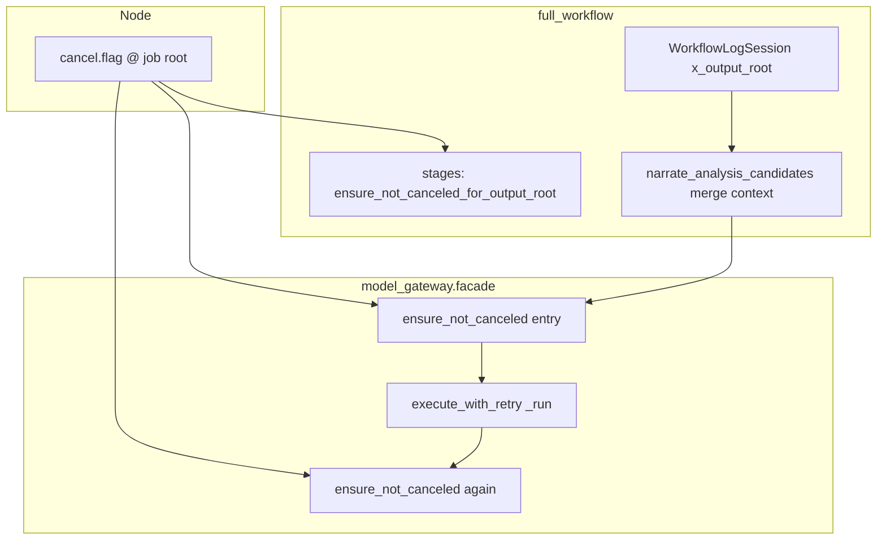

# cancel_signal 与 Gateway 入口取消检查

本文记录 `movieteller_logging.cancel_signal` + `model_gateway.facade` 入口取消检查的调研、**72 分**成因、修复与测试，以及复评置信度。

相关：[local-development.md §10](../reference/local-development.md#10-取消语义与信号生效)、[runner-exit-cancel-fix.md](runner-exit-cancel-fix.md)。

---

## 1. 能力范围

协作式取消在 Python 侧有**两条检查路径**：

| 路径 | API | 典型调用点 |
|------|-----|------------|
| **Job 根目录** | `movie_pipeline.cancel_check` → `JobCanceledError` | `workflow_stages.*`、`pipeline.ensure_not_canceled(speech_output_dir=…)` |
| **日志上下文** | `movieteller_logging.cancel_signal` → `WorkflowCanceledError` | `model_gateway.facade` 每次 chat/embedding/TTS 入口及 `_run` 内 |

Node 在 Job 根写 `cancel.flag`。产品 Job 的 `output_root` 即 `jobs/{jobId}/`，与 `WorkflowLogSession` 绑定的 `x_output_root` 一致。

`full_workflow` / `job_runner` CLI 同时捕获 `JobCanceledError` 与 `WorkflowCanceledError`，写入 `canceled` 终态。

---

## 2. Gateway 入口检查（实现）

`facade.py` 在以下位置调用 `ensure_not_canceled_from_log_context()`：

- `_generate_chat`：函数入口 + `execute_with_retry` 的 `_run` 内
- `_embed_texts`：同上
- `_synthesize_speech`：函数入口 + 各 adapter 的 `_run_*` 内

逻辑（`cancel_signal.py`）：

```text
x_output_root ← current_pipeline_extra()
若 (x_output_root / "cancel.flag").is_file() → raise WorkflowCanceledError
否则无操作
```

**无 `x_output_root` 时**：检查为 no-op（不读磁盘上其它路径的 flag）。单独调用 gateway、或未绑定上下文的脚本**不会**因 cancel 停止。

---

## 3. 为何曾是约 **72** 分

| 扣分项 | 约扣分 | 说明 |
|--------|--------|------|
| **仅 1 条 cancel_signal 单测** | −6 | 未覆盖无上下文、merge 保留字段 |
| **无 Facade 集成测** | −6 | 未证明 gateway 在 flag 存在时不调 provider |
| **无「重试前再检查」测** | −4 | `execute_with_retry` 第二次 `_run` 是否尊重 flag 未验证 |
| **`narrate_analysis_candidates`  wiped `x_output_root`** | −8 | 使用 `bind_pipeline_log_context` 仅写 `stage`/`job_id`，**覆盖** workflow 上下文，旁白阶段 gateway **长期看不到 flag** |
| **双异常 + 双路径易混淆** | −2 | `JobCanceledError` vs `WorkflowCanceledError`；stage 用 output_root，gateway 用 context |
| **无 E2E** | −2 | 长 TTS/embedding 中途取消未手测 |

**72 的本质**：入口检查代码存在，但**旁白主路径上日志上下文常被清空**，gateway 取消检查在最长耗时阶段可能**形同虚设**；测试也未暴露。

---

## 4. 修复与增强（本次）

### 4.1 修复 `pipeline.py` 上下文覆盖

`narrate_analysis_candidates` 由：

```python
pipeline_token = bind_pipeline_log_context(**log_fields)  # 覆盖，丢失 x_output_root
```

改为：

```python
pipeline_token = merge_pipeline_context(**log_fields)  # 保留 x_output_root 等 workflow 字段
```

与 `WorkflowLogSession` 及 segment 级 `merge_pipeline_context(segment_index=…)` 一致。

### 4.2 新增 / 扩展测试

| 文件 | 内容 |
|------|------|
| `movieteller_logging/tests/test_cancel_signal.py` | 无上下文 no-op、空 `x_output_root`、`merge` 保留根目录 + flag |
| `model_gateway/tests/test_facade.py` | chat/embedding：有 flag 不调 API；chat：500 后写 flag 则重试前 `WorkflowCanceledError` |
| `movie_pipeline/tests/test_cancel_check.py` | `speech/audio` 推导 job 根、两种 `ensure_not_canceled` |
| `movie_pipeline/tests/test_pipeline_cancel_context.py` | `narrate_analysis_candidates` 后仍保留 `x_output_root` |

### 4.3 运行测试

```bash
cd /path/to/MovieTeller
export PYTHONPATH="python/movieteller_config/src:python/movieteller_logging/src:python/pipeline_types/src:python/media_utils/src:python/model_gateway/src:python/movie_pipeline/src:python/subtitle_analysis/src"
.venv/bin/python -m pytest \
  python/movieteller_logging/tests/test_cancel_signal.py \
  python/model_gateway/tests/test_facade.py -k "cancel" \
  python/movie_pipeline/tests/test_cancel_check.py \
  python/movie_pipeline/tests/test_pipeline_cancel_context.py -q
```

---

## 5. 复评置信度：**84 / 100**（2026-05-25）

| 维度 | 分数 | 说明 |
|------|------|------|
| **机制正确性**（flag 路径、双入口） | **90** | Job 根与 `x_output_root` 对齐；merge 修复旁白阶段 context |
| **Gateway 贯通** | **88** | chat/embedding 入口 + 重试前检查有 Facade 测；TTS facade cancel 测可再补 |
| **Pipeline / stage 覆盖** | **86** | `cancel_check` 单测；stage 仍主要靠 `ensure_not_canceled_for_output_root`（未逐 stage 测） |
| **无上下文行为** | **82** | 已文档化 + no-op 单测；脚本直调 gateway 仍不取消 |
| **生产 E2E** | **75** | 长调用中途取消、subtitle_context embedding 未手测 |
| **综合** | **≈84** | 自 **72** 上调约 **+12** |

**+12 主要来自**：修复 `x_output_root` 被覆盖（+8）、Facade/merge/无上下文测试（+4）。

**未到 90+**：TTS Facade cancel 用例、真实 Job 中途取消 E2E、videocaptioner 等非 gateway 子进程仍不检查 flag。

---

## 6. 架构示意



---

## 7. 修订历史

| 日期 | 说明 |
|------|------|
| 2026-05-25 | 初稿：72 分成因、pipeline merge 修复、测试与复评 84 |
