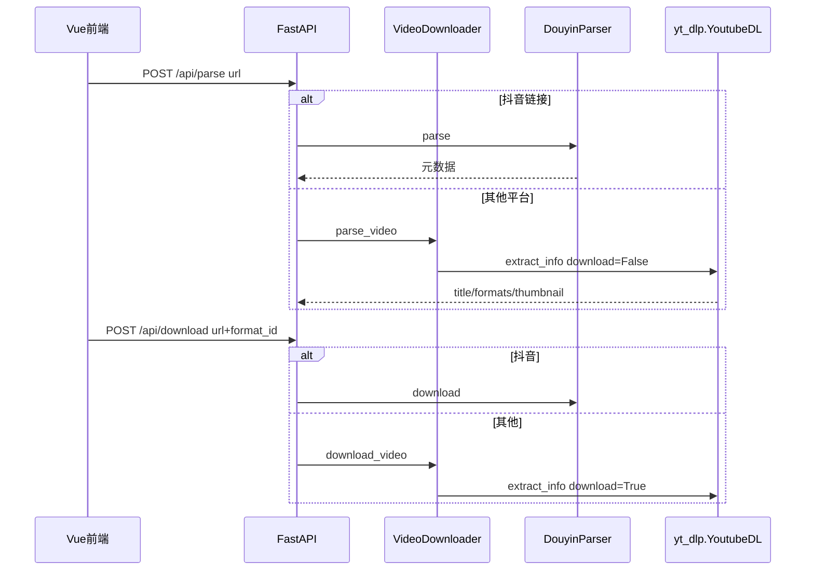

# free-video-downloader 的 yt-dlp 用法分析

> **状态**：调研结论，供 [video-ingest-port-plan.md](video-ingest-port-plan.md) 参考。参考代码位于仓库内 [`free-video-downloader/`](../../free-video-downloader/)（可移植完成后移除）。

## 项目位置与核心文件

| 文件 | 作用 |
|------|------|
| [`backend/downloader.py`](../../free-video-downloader/backend/downloader.py) | yt-dlp 主封装 |
| [`backend/main.py`](../../free-video-downloader/backend/main.py) | FastAPI 路由分发 |
| [`backend/douyin.py`](../../free-video-downloader/backend/douyin.py) | 抖音**不走** yt-dlp |
| [`backend/summarizer.py`](../../free-video-downloader/backend/summarizer.py) | B 站字幕 API（不下载视频） |

---

## 整体架构



**关键点**：并非所有平台都走 yt-dlp；抖音有独立解析器，B 站字幕在 AI 总结里走公开 API。

---

## yt-dlp 怎么用（`VideoDownloader`）

### 调用方式：Python API，不是子进程

```python
import yt_dlp

with yt_dlp.YoutubeDL(ydl_opts) as ydl:
    info = ydl.extract_info(url, download=False)  # 解析
    info = ydl.extract_info(url, download=True)   # 下载
```

### 解析（`parse_video`）— 选项极少

```python
ydl_opts = {
    "quiet": True,
    "no_warnings": True,
    "extract_flat": False,
    "noplaylist": True,
}
```

无 cookies、无 impersonate、无 Referer。

### 下载（`download_video`）

```python
ydl_opts = {
    "format": format_id,
    "outtmpl": "downloads/%(title)s.%(ext)s",
    "quiet": True,
    "noplaylist": True,
}
if has_ffmpeg:
    ydl_opts["ffmpeg_location"] = ffmpeg_path
    ydl_opts["merge_output_format"] = "mp4"
```

---

## 非 yt-dlp 的平台特例

| 平台 | 模块 | 做法 |
|------|------|------|
| **抖音** | `douyin.py` | `requests` + 公开 API；WAF 时 `_solve_waf_and_retry` |
| **B 站字幕** | `summarizer.py` `_extract_bilibili` | `api.bilibili.com/x/web-interface/view` + `x/v2/dm/view` |

**B 站视频下载**在 `downloader.py` 里仍走裸 yt-dlp。BV1Yx411578x 等链接同样会 **HTTP 412**，并非 MovieTeller 独有。

---

## 与 MovieTeller（当前 Node spawn）对比

| 维度 | free-video-downloader | MovieTeller |
|------|----------------------|-------------|
| 调用 | Python `yt_dlp.YoutubeDL` | Node `spawn(yt-dlp)` |
| 流程 | 两阶段 parse → download | 一阶段同步 download → createJob |
| Cookies | 未配置 | 支持 `YT_DLP_COOKIES*` |
| 平台特例 | 抖音独立；B 站仅字幕 API | 无专用下载器 |
| 集成 | `FileResponse` 给用户 | tmp → `createJob` → pipeline |

---

## B 站报错结论

1. free-video-downloader **不能**作为「B 站必成功」参考 — B 站视频仍是默认 yt-dlp。
2. 值得学的是 **按平台分叉**（抖音自建、B 站 API）。
3. MovieTeller 已有 Referer/cookies 配置更完整；B 站仍可能需要有效 cookies（[yt-dlp #14830](https://github.com/yt-dlp/yt-dlp/issues/14830)）。

---

## 本地验证

```bash
cd free-video-downloader/backend
pip install -r requirements.txt
python -c "
from downloader import VideoDownloader
d = VideoDownloader()
print(d.parse_video('https://www.bilibili.com/video/BV1Yx411578x'))
"
```

若同样 412，问题在 yt-dlp/B 站环境，而非 MovieTeller 集成方式。
