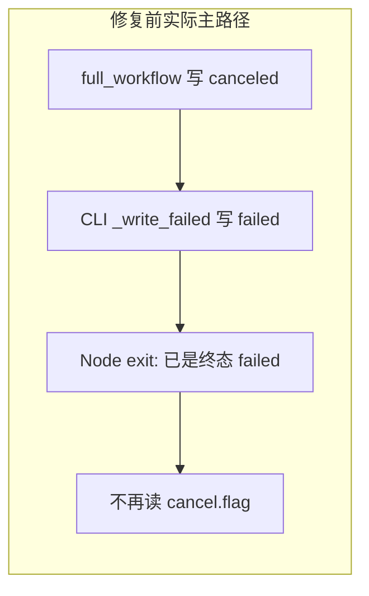
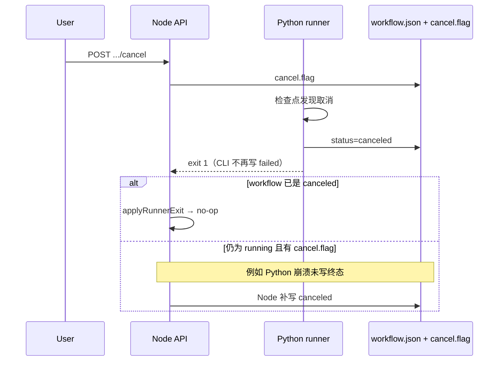

# Runner 退出与取消终态修复记录

本文档记录「用户取消 Job 后，终态应为 `canceled`，却常被标成 `failed`（`runner_exited`）」的调研、根因与修复过程。日常开发中的取消语义仍以 [local-development.md §10](../reference/local-development.md#10-取消语义与信号生效) 为准；本文侧重**问题如何被发现**与**改了什么**。

---

## 1. 背景

MovieTeller 的 Job 由 Node 以 detached 子进程启动 Python `movie_pipeline.job_runner`。取消是**协作式**的：

1. 前端 / API 调用 `POST /api/jobs/:id/cancel`
2. Node 在 Job 目录写入 `cancel.flag`（及 `workflow.json` 中的 `cancel_requested_at`）
3. Python 在检查点读取 flag，抛出 `JobCanceledError` 或 `WorkflowCanceledError`，并将 `workflow.json` 的 `status` 设为 `canceled`
4. Runner 进程退出（通常为**非 0**）
5. Node 在 `child.on('exit')` 中根据磁盘状态决定是否补写终态

设计预期：取消后用户看到 **`canceled`**，而不是 **`failed` + `runner_exited`**。

---

## 2. 方案对比与置信度

本节对比**修复前（低置信）**与**修复后（高置信）**两套方案，说明差异、变化原因，以及为何置信度从约 **78** 提升到约 **88～90**。

### 2.1 置信度怎么理解（0～100）

| 分数段 | 含义 |
|--------|------|
| **≥90** | 根因明确、主路径有单测、与生产观测一致，仅剩 E2E / 边界未覆盖 |
| **80～89** | 逻辑与测试充分，缺真实 Job 取消手测或个别竞态未 E2E |
| **70～79** | 设计「看起来对」，但存在未验证假设、跨进程缺口或已知反例 |
| **<70** | 依赖未证实假设，或代码与文档明显不一致 |

以下分数针对同一能力：**用户取消后，Job 终态稳定为 `canceled`，且不会被 `runner_exited` 误标**。

---

### 2.2 修复前方案（低置信，约 78 分）

#### 设计假设（文档与代码「以为」成立的链路）

```text
用户取消 → Node 写 cancel.flag
         → Python 检查点抛 JobCanceledError，full_workflow 写 canceled
         → runner exit 1
         → Node exit 回调：若仍为 running 且存在 cancel.flag → markJobCanceledByNode
```

核心信念：**只要 Node 在退出时看到 `cancel.flag`，就能把 Job 标成 `canceled`**；Python 写 `canceled` 是主路径，Node 是兜底。

#### 实际实现（修复前）

| 层级 | 实现要点 | 问题 |
|------|----------|------|
| **Python `full_workflow`** | 捕获取消 → 写 `status: canceled` → `raise` | 主路径正确，但被下层破坏 |
| **Python `cli.py`** | `except Exception` → 一律 `_write_failed` | **覆盖**刚写好的 `canceled` 为 `failed` |
| **Node `spawnWorkflowJob`** | `exit` 非 0 + `cancel.flag` → `markJobCanceledByNode` | 仅当 `shouldMarkFailedOnRunnerExit` 为真时生效 |
| **Node `shouldMarkFailedOnRunnerExit`** | 已是终态（含 `failed`）→ 不再改 | CLI 已写成 `failed` 后，**兜底永久失效** |
| **Node `child.on('error')`** | 不读 `cancel.flag`，直接 `spawn_failed` | 取消与 spawn 失败竞态未对齐 |
| **`markJobCanceledByNode`** | 只改 `status`，不清 `error` | UI 可能仍显示旧错误 |

#### 测试覆盖（修复前）

- 仅有 1 条相关单测：直接调用 `markJobCanceledByNode`，**未**模拟 `child.on('exit')`。
- **无** Python 单测验证「CLI 退出不覆盖 `canceled`」。
- **无** 真实视频 Job 取消 E2E。

#### 为何只有约 78 分（扣分拆解）

| 扣分项 | 约扣分 | 说明 |
|--------|--------|------|
| Python CLI 与 `full_workflow` 语义冲突 | **−8** | 主路径在退出前被改坏，与设计文档矛盾，生产易出现 `failed` |
| Node 兜底依赖「仍为 running」 | **−5** | 与 Python 写 `failed` 竞态后，Node 逻辑**从不执行** |
| 单测未覆盖 exit 回调矩阵 | **−4** | 78 分里的「通过测试」不能代表真实退出路径 |
| spawn error 路径未对齐 cancel | **−2** | 边界未验证 |
| 无 E2E 取消手测 | **−3** | 端到端行为未观测 |

**78 分的本质**：Node 侧「`cancel.flag` + 非 0 退出 → `canceled`」在纸面上合理，但**整条跨进程链路在默认情况下走不通**（Python 先写 `failed`），测试也未暴露这一点。



---

### 2.3 修复后方案（高置信，约 88～90 分）

#### 设计原则（双层终态，职责清晰）

| 层级 | 职责 | 终态来源 |
|------|------|----------|
| **Python（主）** | 协作式取消检查点 + `full_workflow` 写盘 | 正常取消 → **`canceled`** 由 Python 写入并保持 |
| **Python CLI** | 退出码与异常分类 | 取消异常 **不** 调用 `_write_failed`；其它异常才写 `failed` |
| **Node（兜底）** | `applyRunnerExit` / `applyRunnerSpawnError` | Python 未写终态但留有 `cancel.flag` → Node 补 **`canceled`** |
| **Node（保护）** | `shouldMarkFailedOnRunnerExit` | 已是 `canceled` / `succeeded` / `failed` → **不覆盖** |

两条独立通路，任一成功即可得到 `canceled`：

1. **主通路**：Python 写 `canceled` → CLI 退出 1 但不改盘 → Node 见终态 `canceled` → no-op。
2. **兜底通路**：Python 崩溃或未写盘，仍为 `running` + `cancel.flag` → Node 写 `canceled` 并 `error: null`。

#### 实际实现（修复后）

| 改动 | 作用 |
|------|------|
| `cli.py` 单独捕获 `JobCanceledError` / `WorkflowCanceledError` | 消除「写 canceled 再改 failed」 |
| `_write_failed` 跳过已有 `canceled` / `succeeded` | 防止其它异常路径覆盖终态 |
| `runnerExit.js` 集中 `applyRunnerExit` / `applyRunnerSpawnError` | exit / spawn 与 `cancel.flag` 决策一致、可单测 |
| `markJobCanceledByNode` 设置 `error: null` | 取消后 UI 不残留 `runner_exited` |

#### 测试覆盖（修复后）

| 类型 | 数量 / 内容 |
|------|-------------|
| Node `applyRunnerExit` 矩阵 | 6 条：flag / 无 flag / SIGTERM / exit 0 / 已终态 / spawn error + flag |
| Node `markJobCanceledByNode` | 1 条：含 `error` 清空 |
| Python CLI | 1 条：`canceled` 不被 `_write_failed` 覆盖 |
| **仍缺** | 真实 API 取消 E2E、长 TTS 中途取消手测 |

#### 为何提升到约 88～90 分（加分拆解）

| 加分项 | 约加分 | 说明 |
|--------|--------|------|
| 根因（CLI 覆盖）已修且有用例锁定 | **+6** | `test_job_runner_cli_does_not_overwrite_canceled_with_failed` |
| Node 退出逻辑可测矩阵 | **+4** | 不再只测 helper，覆盖 `exit` 语义 |
| 主路径 + 兜底路径在代码上可同时成立 | **+5** | 与修复前「二选一失效」相反 |
| 文档与实现一致（含 local-development §10） | **+2** | 降低误用假设 |

**88 vs 90**：若仅看单元测试与代码审查 → **~90**；若要求「真实视频取消 E2E 已跑过」→ 暂记 **~88**，待手测完成可再上调。

---

### 2.4 变化对照与置信度因果

| 维度 | 修复前（~78） | 修复后（~88～90） | 置信度为何变化 |
|------|----------------|------------------|----------------|
| **Python 退出语义** | 取消 ≡ `Exception` → `failed` | 取消 ≡ 专用异常 → 保持 `canceled` | 主路径与文档一致，**消除最大反例** |
| **Node 兜底是否可达** | 常被 `failed` 终态挡住 | `canceled` 保留或 `running`+flag 可补写 | 兜底从「名义存在」变为**常可达** |
| **跨进程契约** | 隐式假设「Python 一定写对」 | 显式：Python 主写 + Node 补写 | 契约可陈述、可测 |
| **单测与真实路径** | 只测 `markJobCanceledByNode` | 测 `applyRunnerExit` + CLI | 测试与生产回调对齐 |
| **spawn 失败** | 忽略 `cancel.flag` | 与 exit 同规则 | 边界一致，减少未知 |
| **用户可见 error** | 可能残留 `runner_exited` | 取消时清空 `error` | 降低「状态 canceled 但显示失败」的困惑 |

**一句话**：置信度提高，不是因为 Node 的 `cancel.flag` 判断变复杂了，而是因为**修掉了让 Node 兜底永远失效的 Python bug**，并用测试把「主路径 + 兜底路径」都钉死。

---

### 2.5 仍未达到 95+ 的原因（上限说明）

| 缺口 | 对分数的影响 |
|------|----------------|
| 无仓库内自动化 E2E（上传 → running → cancel → 查 API） | 真实时序、网关长调用中途取消未验证 |
| 取消仍用进程 exit 1，与真失败相同 | 监控/日志需靠 `workflow.json`，不能单靠退出码 |
| 不向 runner 发 SIGTERM | 极端 hang 时取消可能慢于预期 |
| `.venv` / CI 未统一跑全量 Python 包测试 | 环境差异可能漏跑 CLI 用例 |

完成 [§8 手工验证清单](#8-手工验证清单可选) 后，可将本能力置信度主观上调至 **92～93**；补齐 `scripts/` cancel smoke 后有望 **≥95**。

---

## 3. 症状

| 现象 | 说明 |
|------|------|
| UI / API 显示 `failed` | `error_code` 常为 `runner_exited` 或 CLI 写入的通用失败 |
| `cancel.flag` 仍存在 | 说明用户确实发起了取消 |
| `workflow.json` 曾为 `canceled` | 日志或短暂读取时可见，最终却变成 `failed` |
| Node「补标 canceled」不生效 | `shouldMarkFailedOnRunnerExit` 发现已是终态 `failed`，直接 no-op |

上述症状与 [§2.2](#22-修复前方案低置信约-78-分) 的根因分析一致；修复前整体置信度约 **78**，见该节扣分表。

---

## 4. 调研过程

### 4.1 Node 侧（原有逻辑）

`spawnWorkflowJob.js` 在 runner 非 0 退出时：

- 若 `shouldMarkFailedOnRunnerExit(jobRoot)` 为真（`workflow.json` 仍为 `queued` / `running`）
- 且存在 `cancel.flag` → 调用 `markJobCanceledByNode`
- 否则 → `markJobFailed`，`error_code: runner_exited`

`shouldMarkFailedOnRunnerExit` 在 `status` 已是 `succeeded` / `failed` / `canceled` 时返回 **false**，不再改写。

已有单测 `runner exit with cancel flag should mark canceled not failed` 仅直接调用 `markJobCanceledByNode`，**未**走 `exit` 回调，也未与 Python 联调。

### 4.2 Python 侧（关键发现）

取消在 `full_workflow.py` 中的处理：

```python
except (JobCanceledError, WorkflowCanceledError) as exc:
    # ... 写 workflow.json status="canceled" ...
    raise  # 继续向上抛
```

修复前的 `job_runner/cli.py`：

```python
try:
    run_workflow_job(...)
except Exception as exc:
    _write_failed(store, ...)  # 无条件写 status="failed"
    return 1
```

因此实际顺序为：

1. `full_workflow` 写入 **`canceled`**
2. re-raise `JobCanceledError`
3. CLI `except Exception` 捕获 → **`_write_failed` 覆盖为 `failed`**
4. 进程以退出码 **1** 结束
5. Node `exit` 处理器：读到终态已是 **`failed`** → 不再根据 `cancel.flag` 写 `canceled`

这是根因：**Python 在退出前把正确终态改坏了**，Node 的兜底逻辑无法挽回。

### 4.3 次要问题

| 问题 | 影响 |
|------|------|
| `child.on('error')`（spawn 失败）未检查 `cancel.flag` | 取消与 spawn 失败竞态时可能误标 `spawn_failed` |
| `markJobCanceledByNode` 不清 `error` | 取消后仍可能残留旧的 `runner_exited` 等字段 |
| 退出逻辑散落在 `spawnWorkflowJob.js` | 难以单测矩阵（exit 0、SIGTERM、已有终态等） |

---

## 5. 修复方案

### 5.1 Python：`job_runner/cli.py`

**（1）取消异常单独处理，不调用 `_write_failed`**

```python
except (JobCanceledError, WorkflowCanceledError) as exc:
    print(str(exc), file=sys.stderr)
    return 1
except Exception as exc:
    _write_failed(...)
    return 1
```

取消仍以退出码 **1** 结束（与 Node 非 0 退出语义一致）；终态以 `full_workflow` 已写入的 `canceled` 为准。

**（2）`_write_failed` 保护已有终态**

```python
existing = store.read()
if existing.status in ("canceled", "succeeded"):
    return
```

防止其它路径在已成功/已取消后再次覆盖。

### 5.2 Node：抽出 `runnerExit.js`

| 函数 | 职责 |
|------|------|
| `applyRunnerExit(jobRoot, { code, signal })` | 处理 `child.on('exit')` |
| `applyRunnerSpawnError(jobRoot, err)` | 处理 `child.on('error')`，同样识别 `cancel.flag` |

`spawnWorkflowJob.js` 仅调用上述函数，便于单测。

### 5.3 Node：`markJobCanceledByNode`

补写 `canceled` 时设置 **`error: null`**，避免 UI 仍展示旧的失败信息。

### 5.4 文档

- [local-development.md §10](../reference/local-development.md#10-取消语义与信号生效) — Node 决策表与 Python 前提（简要）
- 本文档 — 完整修复过程（详细）

---

## 6. 修复后的终态决策

### 6.1 Node `applyRunnerExit`

| 条件 | 行为 |
|------|------|
| `workflow.json` 已是终态 | `action: none`（不覆盖） |
| `exit` code `0` 且无 signal | `action: none` |
| 非 0 退出且存在 `cancel.flag` | `action: mark_canceled`，清空 `error` |
| 非 0 退出且无 `cancel.flag` | `action: mark_failed`，`error_code: runner_exited` |

`applyRunnerSpawnError`：在仍为非终态时，有 `cancel.flag` → `canceled`，否则 `spawn_failed`。

### 6.2 时序（修复后）



### 6.3 相关文件

| 路径 | 说明 |
|------|------|
| `python/movie_pipeline/src/movie_pipeline/job_runner/cli.py` | CLI 退出与 `_write_failed` 保护 |
| `python/movie_pipeline/src/movie_pipeline/full_workflow.py` | 取消时写 `canceled` 并 re-raise |
| `server/src/services/jobs/runnerExit.js` | 退出 / spawn 错误决策 |
| `server/src/services/jobs/spawnWorkflowJob.js` | 调用 `applyRunnerExit` |
| `server/src/services/jobs/jobProcess.js` | `markJobCanceledByNode`、`shouldMarkFailedOnRunnerExit` |

---

## 7. 测试

### 7.1 Node（`server/test/jobs.test.js`）

| 用例 | 验证点 |
|------|--------|
| `runner exit with cancel flag should mark canceled not failed` | `markJobCanceledByNode` + `error` 清空 |
| `applyRunnerExit marks canceled when cancel.flag present` | exit 1 + flag → `canceled` |
| `applyRunnerExit marks failed on nonzero exit without cancel.flag` | `runner_exited` |
| `applyRunnerExit treats SIGTERM as failed without cancel.flag` | `code: null` + signal |
| `applyRunnerExit no-op on exit 0` | 保持 `running` |
| `applyRunnerExit no-op when workflow already terminal` | 不覆盖已有 `canceled` |
| `applyRunnerSpawnError honors cancel.flag` | spawn 错误 + flag → `canceled` |

```bash
cd server && npm test
# 预期：16 passed（含上述用例）
```

### 7.2 Python（`python/movie_pipeline/tests/test_job_runner_cli.py`）

`test_job_runner_cli_does_not_overwrite_canceled_with_failed`：模拟 `run_workflow_job` 先写 `canceled` 再抛 `JobCanceledError`，断言 CLI 返回 1 且 **`status` 仍为 `canceled`**。

在仓库根、与 Node 相同的 `PYTHONPATH` 下执行（`.venv` 未装全量 editable 包时也需要）：

```bash
cd /path/to/MovieTeller
export PYTHONPATH="python/movieteller_config/src:python/movieteller_logging/src:python/pipeline_types/src:python/media_utils/src:python/model_gateway/src:python/subtitle_extraction/src:python/subtitle_analysis/src:python/frame_source/src:python/narration/src:python/narration_polish/src:python/narration_speech/src:python/narration_video/src:python/pipeline_transcript/src:python/rerank/src:python/video_render/src:python/subtitle_context/src:python/video_frame_pool/src:python/movie_pipeline/src"
.venv/bin/python -m pytest python/movie_pipeline/tests/test_job_runner_cli.py -q
# 预期：3 passed
```

完整 editable 安装见 [local-development.md §1](../reference/local-development.md#1-python-环境仓库根-venv)。

### 7.3 尚未自动化

- 真实视频 Job：运行中点取消 → 目视确认 `workflow.json` 与前端均为 `canceled`
- Python 崩溃在写 `canceled` 之前、仅留 `cancel.flag` 的兜底（依赖 Node 补写，已有单测覆盖逻辑，无 E2E）

---

## 8. 手工验证清单（可选）

1. 启动 `server` + `client`，上传短视频并创建 Job。
2. 进入 `running` 后调用取消（或 UI「取消」）。
3. 检查 Job 目录：
   - `workflow.json` → `"status": "canceled"`
   - `error` 为 `null` 或取消相关非 `runner_exited`
4. 检查 `logs/runner.stderr.log` 含取消异常信息，退出码非 0 属预期。
5. Job 面板可「重试」：`POST /api/jobs/:id/retry` 清除 `cancel.flag` 并 `queued`。

---

## 9. 经验与后续

| 教训 | 说明 |
|------|------|
| 子进程退出码 ≠ 业务终态 | 取消故意用 exit 1；终态以 `workflow.json` + `cancel.flag` 为准 |
| re-raise 要与 CLI 顶层异常处理对齐 | `except Exception` 会吞掉「已写好的 canceled」 |
| Node 兜底不能替代 Python 正确写盘 | 终态已是 `failed` 时 Node 无法再改成 `canceled` |
| 单测应覆盖「退出回调」而不只 helper | 抽出 `runnerExit.js` 后矩阵可测 |

可选改进（未做）：

- 取消时 CLI 使用约定退出码（如 130）供监控区分
- `scripts/` 下增加 cancel smoke（依赖本地 API + 短视频）
- 对 detached runner 发送 SIGTERM（需与 Python 信号处理协同，见产品化路线图）

---

## 10. 修订历史

| 日期 | 说明 |
|------|------|
| 2026-05-25 | 初稿：记录 cancel.flag / runner exit 调研与 Python CLI + Node runnerExit 修复 |
| 2026-05-25 | 增补 §2：修复前后方案对比、置信度 78→88～90 及成因分析 |
