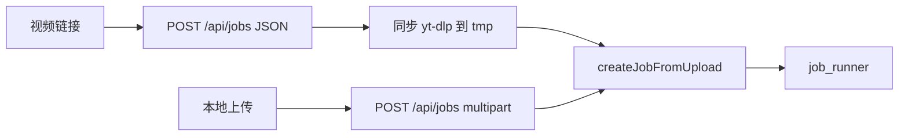
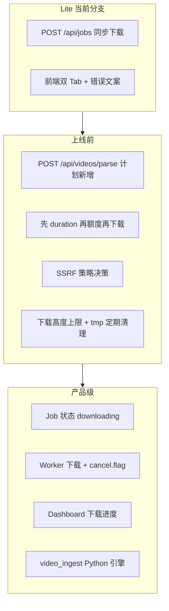

# URL 视频下载（yt-dlp）— Phase 2 Lite

> **状态**：当前分支**已实现**（Node `spawn yt-dlp` + 前端双 Tab），**待提交 / 验收**。本文档描述的是 **Lite 版**，**不是**最终产品形态。演进路线见下文「分阶段路线图」与 [video-ingest-port-plan.md](video-ingest-port-plan.md)。

## 定位

| | Lite 版（当前） | 目标形态（Job 系统） |
|--|----------------|---------------------|
| 产品类比 | 类似 free-video-downloader 的「下载器」同步等待 | MovieTeller Job 流水线 |
| 下载时机 | `POST /api/jobs` 内 `await downloadRemoteVideo`，**有 jobId 前无任务** | 先建 Job（`downloading`），Worker 下载，可取消/看进度 |
| 额度 | **先全量下载** → `probeDurationSec` → `reserveQuota` | **先 parse 拿 duration** → 额度判断 → 再下载 |
| 适用 | 小并发、Phase 2 Lite、改动小 | 产品级、长视频、B 站/YouTube |

free-video-downloader 的两段式（[`/api/parse` → `/api/download`](../../free-video-downloader/backend/main.py)）适合「下载器」；MovieTeller 应吸收 **parse 元数据**，但下载应纳入 **Job 阶段**，而非长期占用 API 连接。

---

## 当前实现链路

实现位置：

- [`server/src/routes/jobs.js`](../../server/src/routes/jobs.js) — JSON 路径 `await downloadRemoteVideo`（约 L118–132），`req.setTimeout` 15 分钟（约 L74）
- [`server/src/services/media/downloadRemoteVideo.js`](../../server/src/services/media/downloadRemoteVideo.js) — `spawn yt-dlp`，`-f bv*+ba/b`
- [`server/src/services/media/validateSourceUrl.js`](../../server/src/services/media/validateSourceUrl.js) — hostname 级 SSRF
- 前端 `VideoSourceTabs` / `VideoUrlInput` — 提交前仅显示「正在下载视频…」，**无 Job 详情/取消**

---

## 已知问题（评审记录）

### 高

| # | 问题 | 说明 | 建议 |
|---|------|------|------|
| 1 | **同步下载占用 API，下载阶段不可取消** | 下载完成才返回 `jobId`；无 Job detail、进度、`cancel.flag`、retry | Lite 可保留；**文档与 UI 标明非终态**。下一阶段：`POST /api/jobs` 先建 `queued`/`downloading` Job，Worker 执行 yt-dlp，Dashboard 显示「下载中」，取消杀子进程 |
| 2 | **先下载再额度判断，浪费流量** | 额度不足时可能已下完最大 500MB | **上线前建议项**：`extract_info` / `--dump-json --skip-download` 先拿 `duration` → `reserveQuota` 预检 → 再全量下载（free-video-downloader 已有 [`parse_video`](../../free-video-downloader/backend/downloader.py) 模式） |
| 3 | **SSRF 不完整** | 仅拦 URL hostname（localhost、私网字面 IP）；**不查 DNS 解析结果**；**不拦 yt-dlp 跟随的 302 到内网** | 短期：域名 allowlist 或下载前 `dns.lookup` 拒绝私网；长期：yt-dlp 执行环境网络隔离 |

### 中

| # | 问题 | 建议 |
|---|------|------|
| 4 | **「支持所有站点」过于乐观** | 文案改为：「优先支持 yt-dlp 可下载的**公开**链接；YouTube/B 站常需 cookies；抖音等需专用模块」 |
| 5 | **固定 `bv*+ba/b` 可能下 4K 大文件** | 不需要完整格式 UI；固定策略如 `bestvideo[height<=720]+bestaudio/best[height<=720]/best`，可配置 `YT_DLP_MAX_HEIGHT` |
| 6 | **`/tmp/movieteller_dl_*` 泄漏** | 失败路径有 `removeDownloadDir`；进程崩溃可能遗留。加启动/定时清理（如 >24h） |
| 7 | **无下载进度 / Job 阶段日志** | 同步版至少 UI 提示「下载完成前不会创建任务」；产品级纳入 Job `current_stage=downloading` |

### 低

| # | 问题 | 建议 |
|---|------|------|
| 8 | **文档「已落地」表述** | 改为「分支已实现，待提交/验收」 |

---

## 站点与能力边界（修订）

**不要承诺**「yt-dlp 支持的所有站点」。

| 来源 | 预期 |
|------|------|
| 通用公开 URL | yt-dlp，视平台反爬而定 |
| YouTube | 常需 `YT_DLP_COOKIES*`；`impersonate` 依赖 `curl_cffi` |
| B 站 | 常 HTTP 412，需 cookies；见 [free-video-downloader-analysis.md](free-video-downloader-analysis.md) |
| 抖音 | 当前无专用模块；移植计划含 `douyin.py` 分叉 |

---

## 已纳入的成本控制

- `--max-filesize 500M`、`--no-playlist`
- URL hostname 校验 + 基础 SSRF（见上，**不足**）
- 失败时 `removeDownloadDir(tmpDir)`
- B 站自动 `Referer`（[`ytDlpOptions.js`](../../server/src/services/media/ytDlpOptions.js)）

---

## 分阶段路线图

| 阶段 | 内容 | 文档 |
|------|------|------|
| **Lite** | Node spawn、同步 createJob | 本文 |
| **上线前** | parse API、元数据优先配额、SSRF 加强、格式/清理 | [video-ingest-port-plan.md](video-ingest-port-plan.md) §Phase A |
| **产品级** | 异步 downloading Job、可取消、进度 | [video-ingest-port-plan.md](video-ingest-port-plan.md) §Phase C |

### 上线前：阻断决策 vs 建议项

**以下两项必须在对外上线前做出明确决定**（不做决定 = 不能算验收完成）：

| 决策项 | 选项 | 默认建议 | 不做时的风险 |
|--------|------|----------|--------------|
| **元数据优先是否必须做** | A) 必须：先 parse duration → 额度 → 再下载 B) 暂不做：维持 Lite「先下载再额度」 | **A（必须）** | 额度不足仍可能先下满 500MB，浪费流量与等待时间 |
| **SSRF 策略选型** | A) 域名 allowlist（如 youtube.com、bilibili.com） B) DNS 解析后拒绝私网 C) A + B 组合 | **C（组合）** | 仅 hostname 校验挡不住 DNS 到私网、302 跳内网 |

**建议项**（强烈建议上线前完成，但可记录为已知风险后灰度）：

| 项 | 内容 |
|----|------|
| A4 | 下载高度上限（`YT_DLP_MAX_HEIGHT`） |
| A5 | `movieteller_dl_*` 定时清理（>24h） |
| A6–A7 | 前端 parse 预览、站点/cookies 文案 |

**可延后至 Phase C**（Lite 可接受，文档与 UI 标明非终态）：

- 异步 `downloading` Job、Worker 下载、取消与 Dashboard 进度

### 当前 vs 计划 API

| 端点 | 状态 | 说明 |
|------|------|------|
| `POST /api/jobs`（JSON `sourceUrl`） | **已实现**（Lite） | 同步 `await downloadRemoteVideo` 后再返回 `jobId` |
| `POST /api/videos/parse` | **计划新增**（Phase A1） | 当前代码**无此接口**；路线图用于元数据预览与额度预检 |

---

## 测试缺口（验收清单）

- [ ] 三类链接：普通公开、YouTube（+cookies）、B 站 412（+cookies）
- [ ] 大文件：>500MB 拒绝、>10min 超时、中断后 tmp 残留
- [ ] **额度不足**：确认是否先下载再失败（当前行为）及是否可接受
- [ ] SSRF：localhost（已有单测）、**DNS 到私网**、**重定向到私网**（未覆盖）
- [ ] `YT_DLP_IMPERSONATE=chrome` 且未装 `curl_cffi` 时的失败提示
- [ ] 同步等待期间前端文案是否足够（「下载完成前不会创建任务」）

---

## 配置

- `YT_DLP_PATH`、`YT_DLP_COOKIES`、`YT_DLP_COOKIES_FROM_BROWSER`、`YT_DLP_IMPERSONATE`
- 建议新增（计划）：`YT_DLP_MAX_HEIGHT`、`VIDEO_PARSE_TIMEOUT_MS`
