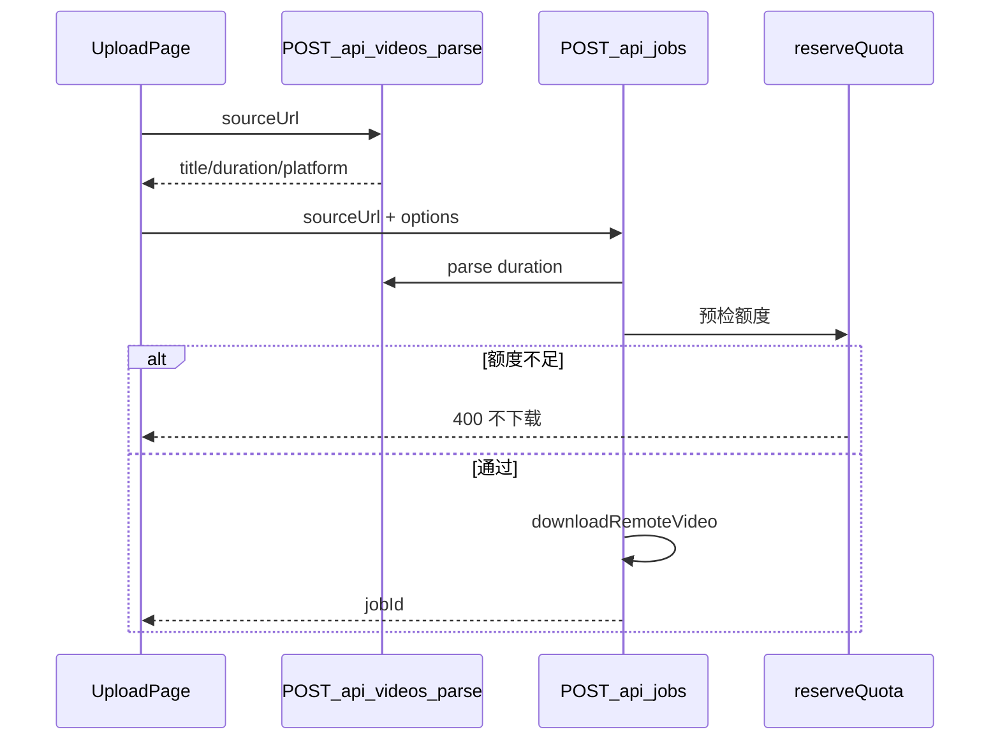
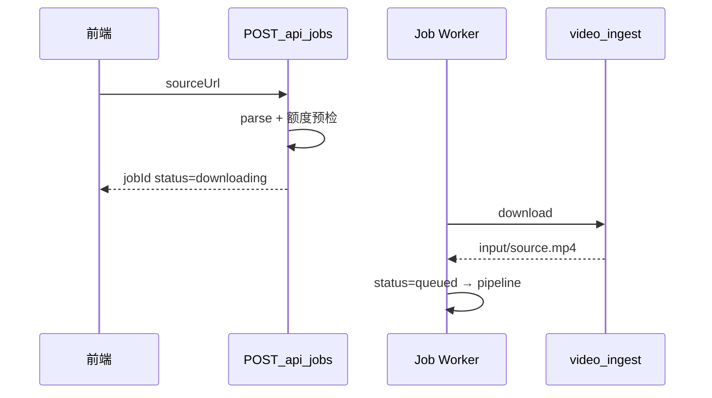

# 移植 free-video-downloader 下载能力到 MovieTeller

> **状态**：待实施。吸收 free-video-downloader 的 **parse → download 两段式**与**平台分叉**；**不**照搬其「同步下载后返回文件」模型。  
> Lite 现状与问题见 [url-video-download-ytdlp.md](url-video-download-ytdlp.md)；参考分析见 [free-video-downloader-analysis.md](free-video-downloader-analysis.md)。

## 总原则

1. **元数据优先不是二期可选项，而是上线前建议项** — 先 `extract_info(download=False)` / `--dump-json --skip-download` 拿 `duration`，再额度判断，再全量下载。
2. **parse API 与异步 downloading Job 分工** — parse 用于预览与预检；产品级下载纳入 Job 阶段（可取消、有进度）。
3. **不移植** free-video-downloader 的 SSRF 假设（公开下载器）；MovieTeller 需加强校验与隔离。
4. **不移植** Stripe、AI 总结、完整格式选择 UI；**要移植** `downloader.py`、`douyin.py`、router 模式。

---

## 分阶段实施

### Phase A — 上线前加固（在 Lite 之上，仍可为同步 createJob）

优先级高于「仅换 Python 引擎」。

#### 上线前阻断决策（必须决定）

| 决策 | 说明 | 默认建议 |
|------|------|----------|
| **元数据优先是否必须做** | A2：先 parse `duration` → `reserveQuota` → 再 `downloadRemoteVideo` | **必须做**；否则额度不足仍可能先全量下载 |
| **SSRF 策略** | A3：allowlist **或** DNS 私网拒绝 **或** 组合 | **allowlist + DNS 组合**；302 跳内网仍需长期网络隔离 |

以下为 Phase A 工作项；**A1–A3 与上表决策绑定**，A4–A7 为强烈建议项。

| 项 | 阻断 | 内容 | 涉及 |
|----|------|------|------|
| A1 | 随元数据决策 | **`POST /api/videos/parse`（计划新增 API）** | 新建 [`server/src/routes/videos.js`](../../server/src/routes/videos.js)；**当前代码无此路由** |
| A2 | **是** | **元数据优先配额** | `jobs.js` JSON：parse → `reserveQuota` → download → `probeDurationSec` |
| A3 | **是** | **SSRF 加强** | [`validateSourceUrl.js`](../../server/src/services/media/validateSourceUrl.js)：按上表选型 |
| A4 | 建议 | **下载格式策略** | `bestvideo[height<=720]+...`；`YT_DLP_MAX_HEIGHT` |
| A5 | 建议 | **tmp 兜底清理** | 启动/定时删除 `movieteller_dl_*`（>24h） |
| A6 | 建议 | **前端 parse 预览** | `VideoParsePreview`；依赖 A1 |
| A7 | 建议 | **产品文案** | 公开链接；cookies；不保证所有站点 |



### Phase B — Python `video_ingest` 引擎

| 项 | 内容 |
|----|------|
| B1 | 新建 [`python/video_ingest/`](../../python/video_ingest/)：`downloader.py`、`douyin.py`、`router.py`、`cookies.py`、`bilibili_meta.py`（parse 降级） |
| B2 | CLI：`parse` / `download` JSON stdout；[`runVideoIngest.js`](../../server/src/services/media/runVideoIngest.js) 桥接 |
| B3 | 替换 [`downloadRemoteVideo.js`](../../server/src/services/media/downloadRemoteVideo.js) 内部实现；注册 [`pythonRuntime.js`](../../server/src/services/pythonRuntime.js) |
| B4 | 依赖：`yt-dlp`、`requests`；文档注明 `curl_cffi` 与 `impersonate` |

### Phase C — 产品级：下载作为 Job 阶段（最终形态）

解决 [url-video-download-ytdlp.md](url-video-download-ytdlp.md) 问题 #1、#7。

| 项 | 内容 |
|----|------|
| C1 | DB migration：`jobs.status` 增加 `downloading`（或 `progress` 子阶段） |
| C2 | `POST /api/jobs`（URL）仅创建 Job + 写 `sourceUrl`，**不**在 API 内 await 全量下载 |
| C3 | Worker / 内联队列：claim → yt-dlp 下载到 `input/source.mp4` → 状态 `queued` → spawn pipeline |
| C4 | 取消：`cancel.flag` + kill yt-dlp 子进程；Dashboard「下载中」 |
| C5 | 可选：yt-dlp progress hook 写入 `workflow.json` / `logs` |



---

## Phase A 实现要点（`video_ingest` 包）

路径：[`python/video_ingest/`](../../python/video_ingest/)

| 源（free-video-downloader） | 目标 |
|----------------------------|------|
| `downloader.py` | `parse` / `download`（`YoutubeDL` API） |
| `douyin.py` | 抖音分叉 |
| `summarizer.py` B 站 view API | `bilibili_meta.py`（仅 parse 降级） |

CLI：

```bash
python -m video_ingest parse --url <url> --json
python -m video_ingest download --url <url> --output-dir <dir> --json
```

**download 默认 format**（Phase A4）：

```text
bestvideo[height<=720]+bestaudio/best[height<=720]/best
```

---

## API 摘要

| 端点 | 状态 | 阶段 | 说明 |
|------|------|------|------|
| `POST /api/videos/parse` | **计划新增** | A1 | 预览；`video_parse_failed`；**当前未实现** |
| `POST /api/jobs` JSON | **已实现**（Lite） | A→C | 当前：同步下载后返回 `jobId`；C：仅建 `downloading` Job |

---

## 测试（含评审清单）

| 类别 | 用例 |
|------|------|
| 链接 | 公开视频、YouTube+cookies、B 站 412+cookies、抖音（douyin 模块） |
| 体量 | >500MB、超时、中断 tmp |
| 额度 | **额度不足时不应全量下载**（Phase A2 验收） |
| 安全 | localhost、DNS→私网、重定向私网（A3） |
| 依赖 | 无 `curl_cffi` 时 impersonate 失败提示 |
| 引擎 | Python router 单测、Node bridge mock |

---

## 风险

| 项 | 说明 |
|----|------|
| B 站 412 | 视频下载仍依赖 cookies；`bilibili_meta` 不替代视频字节 |
| `downloading` 状态 | Phase C 需 migration + 前后端状态机 |
| 代码来源 | 移植 `douyin.py` / `downloader.py` 保留注释 |

---

## 推荐实施顺序

1. **Phase A1–A2**：parse API + 元数据优先配额（**最高 ROI**）
2. **Phase A3–A5**：SSRF、格式上限、tmp 清理
3. **Phase A6–A7**：前端预览与文案
4. **Phase B**：`video_ingest` 替换 Node spawn
5. **Phase C**：downloading Job + Worker + 可取消
