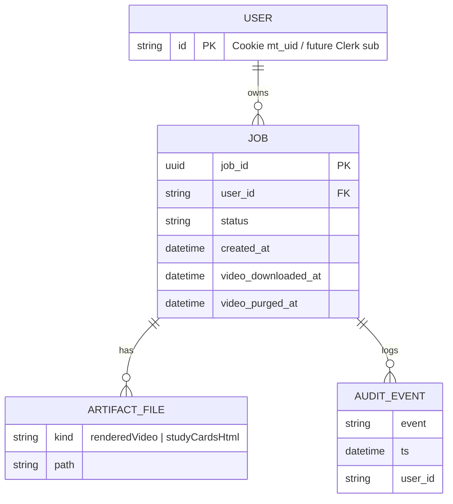

# Multi-User Data Model

Phase 1 以文件系统为存储；Phase 2 引入 Postgres。合同行为见 [job-lifecycle.md](job-lifecycle.md)。

## ER（逻辑）



## 实体映射

| 实体 | Phase 1（现状） | Phase 2+ |
|--------|-----------------|----------|
| **User** | `req.user.id` from Cookie `mt_uid` | `users(id, clerk_sub, ...)` |
| **Job** | `{JOBS_ROOT}/{jobId}/workflow.json` | `jobs` 行 + 同目录或对象存储 |
| **Artifact** | `artifacts/manifest.json` + 文件路径 | manifest + 可选 S3 URL |
| **Audit** | `logs/audit.jsonl` | 集中 `audit_events` 表（可选） |
| **RetentionPolicy** | 代码：3 天删目录、下载后删视频 | 按 Plan 配置 |
| **Plan / Credits** | 未实现 | `plans`, `subscriptions` |

## 关系与约束

- **User 1—N Job**：`workflow.user_id` 必填才可见；无 `user_id` 的历史 Job 对所有用户 404。
- **Job 1—N Artifact**：仅 manifest 中声明的 kind；无 manifest 则无产品产物。
- **Job 1—N Audit**：追加写 JSONL；事件列表见 job-lifecycle § Audit。

## 身份流

```text
Browser Cookie (mt_uid)
  → currentUser middleware
  → POST /api/jobs 写入 user_id（忽略 body userId）
  → jobAccess.*ForUser 过滤
```

未来（可选 PR-F）：Clerk session → `user_id` = Clerk `sub`（或映射表）→ **jobAccess 不变**。

## 索引建议（Phase 2）

| 表 | 索引 |
|----|------|
| `jobs` | `(user_id, updated_at DESC)` 列表 |
| `jobs` | `(status, created_at)` worker claim |
| `jobs` | `(user_id, job_id)` ACL |

## 与队列

Phase 1 队列为进程内内存；Phase 2 见 [phase2-queue-design.md](../planning/phase2-queue-design.md)。
